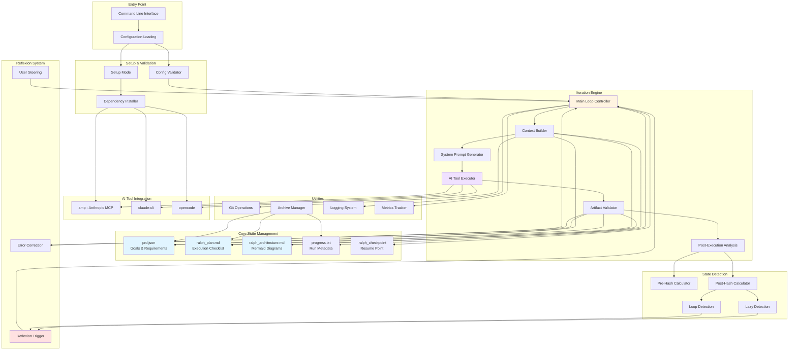
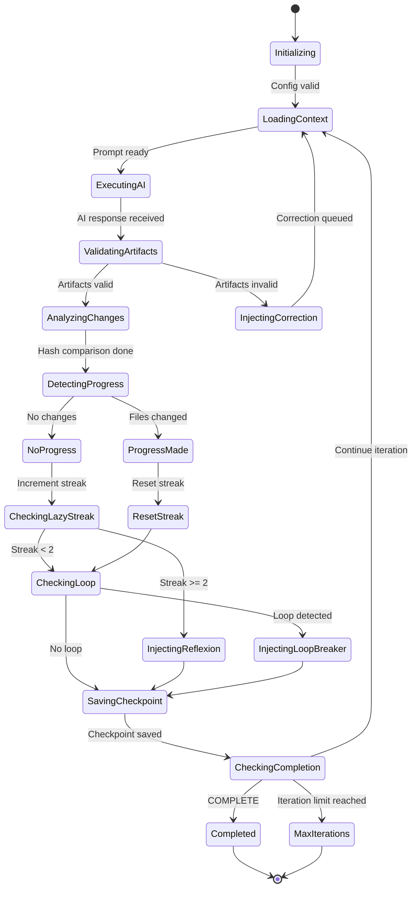
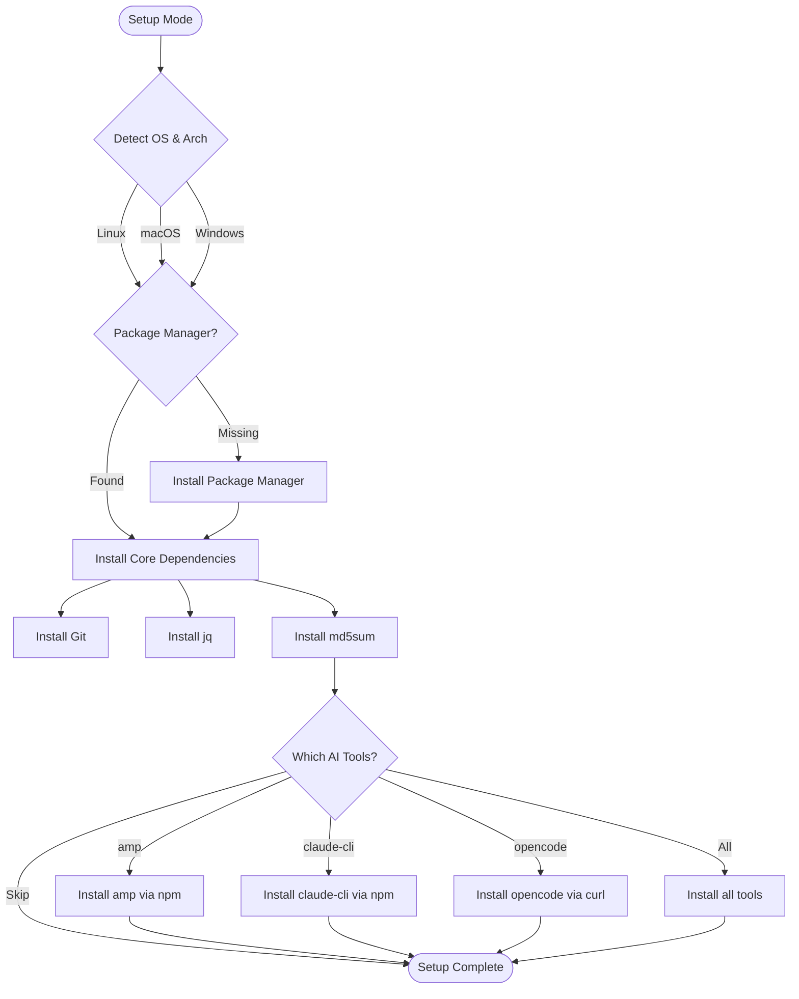
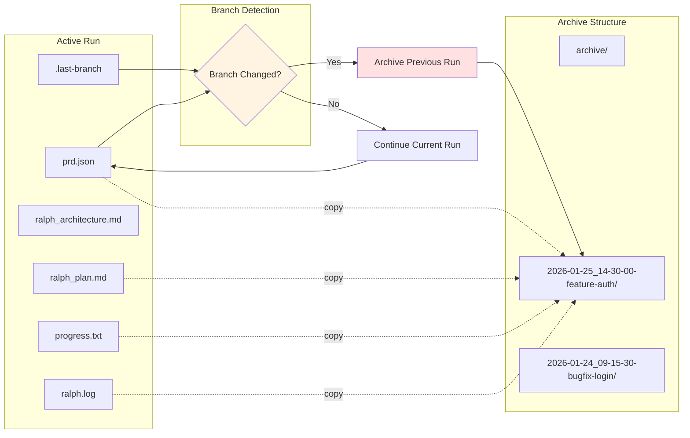

# Ralph Wiggum Agent Architecture

## System Overview

## Data Flow Sequence

```mermaid
sequenceDiagram
    participant User
    participant CLI
    participant Setup
    participant MainLoop
    participant Context
    participant AI
    participant Validator
    participant State
    participant Files

    User->>CLI: ./ralph.sh --tool opencode
    CLI->>Setup: Load config & validate
    Setup->>State: Check for resume checkpoint
    State-->>Setup: Last iteration (if any)
    
    Setup->>MainLoop: Start main loop
    
    rect rgb(13, 17, 23)
        Note over MainLoop,Files: Iteration Loop (1 to MAX_ITERATIONS)
        
        MainLoop->>Context: Build context window
        Context->>Files: Read PRD, Plan, Diagram
        Files-->>Context: Current state
        Context->>Files: Read git diff (optional)
        Files-->>Context: Recent changes
        
        Context->>Context: Generate system prompt
        Context->>State: Hash project state (before)
        
        MainLoop->>AI: Execute tool with prompt
        AI-->>MainLoop: Agent response
        
        MainLoop->>Validator: Validate artifacts
        Validator->>Files: Check PRD JSON validity
        Validator->>Files: Check Mermaid syntax
        Validator->>Files: Check Plan checkboxes
        Validator-->>MainLoop: Errors (if any)
        
        MainLoop->>State: Hash project state (after)
        State->>State: Compare hashes
        
        alt No changes detected
            State->>State: Increment lazy streak
            State->>MainLoop: Inject reflexion trigger
        else Changes detected
            State->>State: Reset lazy streak
        end
        
        alt Loop detected
            State->>MainLoop: Inject loop-breaking trigger
        end
        
        MainLoop->>State: Save checkpoint
        MainLoop->>Files: Update metrics log
        
        alt Completion signal detected
            MainLoop-->>User: Task complete!
        else Continue iteration
            MainLoop->>MainLoop: Next iteration
        end
    end
    
    MainLoop-->>User: Max iterations reached
```

## State Tracking & Reflexion

## Dependency Installation Flow

## File Management & Archiving

This diagram system shows:

1. **System Overview**: The complete architecture with all major components and their relationships
2. **Data Flow Sequence**: How information flows through the system during execution
3. **State Tracking**: The state machine showing how Ralph detects and responds to stalls and loops
4. **Dependency Installation**: The setup process for different operating systems
5. **File Management**: How archiving and branch tracking work

The architecture implements a sophisticated "Grounded Architecture" pattern where the agent maintains consistency across three key artifacts (PRD, Plan, Diagram) while using reflexion techniques to detect and break out of unproductive loops.
