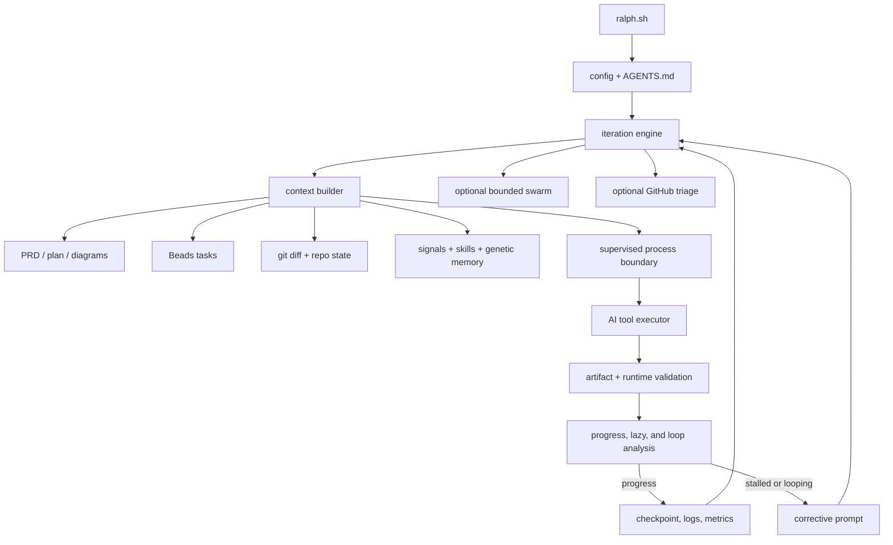

# Ralph

Ralph is a long-running autonomous agent loop for software projects. It keeps an AI coding tool grounded in project artifacts, task state, logs, and recent changes; detects stalls or loops; and can resume, retry, and coordinate bounded multi-agent work.

Use Ralph when you want an agent to keep working from a persistent plan instead of a single prompt.

## What Ralph Does

- Runs an iterative agent loop through tools such as `opencode`, `claude`, `amp`, `agy`, `codex`, `jules`, and GitHub Copilot.
- Grounds each iteration in project instructions, Beads task state, run artifacts, git context, and optional extra context files.
- Detects lazy/no-op iterations and repeated loop signatures, then injects corrective prompts.
- Stores recurring problems as signals and promotes proven fixes into guarded skills.
- Supports resumable runs, retry/backoff, circuit breakers, bounded swarm workers, and GitHub triage helpers.

## Quick Start

```bash
# Install or verify dependencies
./ralph.sh --setup

# Initialize Ralph artifacts in a project
./ralph.sh --init

# Run one agent loop with the default tool
./ralph.sh

# Run a single iteration, useful for cron or CI
./ralph.sh --once
```

Run all tests:

```bash
./tests/run_all.sh
```

## How It Fits Together


```mermaid
flowchart TD
    CLI["ralph.sh"] --> Config["config + AGENTS.md"]
    Config --> Loop["iteration engine"]

    Loop --> Context["context builder"]
    Context --> Artifacts["PRD / plan / diagrams"]
    Context --> Tasks["Beads tasks"]
    Context --> Git["git diff + repo state"]
    Context --> Memory["signals + skills + genetic memory"]

    Context --> Boundary["supervised process boundary"]
    Boundary --> Tool["AI tool executor"]
    Tool --> Validate["artifact + runtime validation"]
    Validate --> Analyze["progress, lazy, and loop analysis"]

    Analyze -->|progress| Persist["checkpoint, logs, metrics"]
    Analyze -->|stalled or looping| Reflexion["corrective prompt"]
    Reflexion --> Loop
    Persist --> Loop

    Loop --> Swarm["optional bounded swarm"]
    Loop --> Triage["optional GitHub triage"]
```

Ralph revolves around a few durable files and stores:

| Path | Purpose |
|------|---------|
| `AGENTS.md` | Project-specific agent instructions. |
| `prd.json` | Product requirements, when the target project uses Ralph-managed requirements. |
| `ralph_plan.md` | Human-readable task plan synced from Beads. |
| `ralph_architecture.md` | Architecture notes and Mermaid diagrams. |
| `.ralph_checkpoint` | Resume point for interrupted runs. |
| `.ralph/runs/<run-id>/` | Per-run traces and recovery data. |
| `.ralph/runs/<run-id>/run.json` | Atomic lifecycle manifest with monotonic heartbeat sequence, progress, limits, resume lineage, and terminal outcome. |
| `.ralph/runs/<run-id>/process-cleanup.json` | Bounded, sanitized, allowlisted provider/live-smoke cleanup latency and escalation evidence. |
| `.ralph/runs/<run-id>/providers/` | Provider state such as normalized opencode JSON events or Jules session metadata. |
| `.ralph/artifacts/verification.json` | Ralph-owned evidence for declared verification commands, exit codes, timeouts, and output tails. |
| `.ralph/artifacts/live-smoke.json` | Opt-in live app smoke evidence: command, port, probes, diagnostics, and server log tail. |
| `.ralph/artifacts/signals/` | Deduplicated recurring problems. |
| `.ralph/artifacts/skills/` | Candidate and approved project-local fixes. |
| `~/.config/ralph/skills/` | Optional cross-project skills. |
| `~/.config/ralph/memory/` | Cross-project genetic memory. |

## Run Lifecycle Evidence

Every iterating run writes `.ralph/runs/<run-id>/run.json`. It is an allowlisted operational record: Ralph does not copy environment variables, prompts, provider responses, or secret values into this file.

```bash
jq '{run_id, status, reason, phase, heartbeat_at, heartbeat_sequence, current_iteration, progress}' .ralph/runs/latest/run.json
```

| Status | Meaning |
|--------|---------|
| `initializing` | Run directory and manifest exist; bootstrap is still in progress. |
| `running` | The loop or a local/remote provider is active. |
| `completed` | The completion gates passed or the tracked backlog drained. |
| `paused` | An intentional `--once` scheduler handoff. |
| `incomplete` | The iteration ceiling was reached before completion. |
| `failed` | A model, provider, stall, budget, or unexpected process failure stopped the run. |
| `interrupted` | HUP, INT, TERM, or a stale active manifest from an unclean exit. |

Writes use same-directory temporary files and atomic renames. Heartbeat replacements are serialized, and `heartbeat_sequence` starts at `0` and increments exactly once for each persisted heartbeat. If a process dies before its EXIT trap can finalize, the next singleton run marks the prior active manifest `interrupted` with reason `unclean_exit_detected`, preserves its final heartbeat sequence, and records the recovering run ID.

### Executor Boundaries

Every local AI provider and live-smoke server starts through `lib/process_supervisor.py` in a dedicated Unix session and process group. Before the command is released, Ralph validates a mode-`600` ephemeral handshake against the supervisor PID, process start tokens, parent PID, process-group ID, and session ID. The handshake is then deleted.

Timeout, signal, verification, and parent-death cleanup send TERM to the complete validated group, wait for the configured grace period, and escalate remaining members to KILL. The supervisor preserves the direct command's exit code and does not report completion while in-group descendants remain. This closes late-fork and daemonized-child races that PID-tree snapshots cannot close.

Process groups provide lifecycle ownership, not a security boundary against a deliberately escaping process. Use `--sandbox` when the executor itself is untrusted.

### Reliability Soak

Run a network-free, disposable TERM/KILL recovery cycle against the real entry point:

```bash
tests/unattended_soak.sh --cycles 2 --duration 120 --seed 42 \
  --output /tmp/ralph-soak.json
jq '{status, fault_runs, retention, failures}' /tmp/ralph-soak.json
```

Each cycle injects both signals in seeded random order, resumes from the prior checkpoint, verifies provider-boundary cleanup, cleanup evidence, and stale-manifest reconciliation, and enforces run retention. The mode-`600` JSON report is allowlisted and excludes prompts, logs, environment values, commands, and temporary paths. `--duration` is a wall-clock ceiling checked between cycles; an active cycle always finishes.

## Common Commands

### Agent Loop

```bash
./ralph.sh                         # default tool
./ralph.sh --tool opencode         # choose a tool
./ralph.sh --tool codex            # OpenAI Codex via `codex exec`
./ralph.sh --tool jules            # Jules remote executor; requires JULES_API_KEY and a connected source
./ralph.sh --model "provider/id"   # pin a model
./ralph.sh --max-iterations 20     # change loop limit
./ralph.sh --resume                # resume from checkpoint
./ralph.sh --interactive           # pause between iterations
./ralph.sh --unattended            # no interactive prompts
./ralph.sh --sandbox               # run in Docker sandbox
./ralph.sh --no-sandbox            # explicitly accept host execution
./ralph.sh --context docs/api.md   # add context files
./ralph.sh --diff-context          # include recent git diff
./ralph.sh --review                # self-tuning review pass, no AI call
./ralph.sh --test                  # native runtime self-test
```

Supported AI tools:

| Tool | Notes |
|------|-------|
| `opencode` | Default and recommended general router. |
| `claude` | Uses Claude Code conventions, including `CLAUDE.md` when present. |
| `amp` | Anthropic MCP workflow. |
| `agy` | Google Antigravity CLI. |
| `codex` | OpenAI Codex CLI, executed in sandboxed mode. |
| `jules` | Asynchronous Jules REST executor. PR mode creates/records a remote PR; patch mode applies returned diffs locally. |
| `copilot` | Available through the Copilot subcommands below. |

### Copilot

```bash
./ralph.sh copilot auth
./ralph.sh copilot run "Refactor the login function"
./ralph.sh copilot explain "How does the event bus work?"
```

### Signals, Skills, and Lint

```bash
./ralph.sh signal ls
./ralph.sh signal show <key>
./ralph.sh signal resolve <key> "fixed by adding the missing module"
./ralph.sh signal recall

./ralph.sh skill ls
./ralph.sh skill approve <theme>
./ralph.sh skill reject <theme>
./ralph.sh skill globalize <theme>
./ralph.sh skill global

./ralph.sh lint
```

Signals are recurring issues Ralph keeps seeing. Skills are guarded fixes that can be recalled when matching signals reappear. `lint` is a read-only curator pass over that knowledge store.

### Cleanup latency stats

```bash
./ralph.sh cleanup-stats                 # aggregate across .ralph/runs
./ralph.sh cleanup-stats /path/to/runs   # or an explicit run root
```

`cleanup-stats` is a read-only pass over retained `process-cleanup.json` artifacts. It prints an allowlisted JSON summary — per-kind (`provider`, `live_smoke`) sample count, nearest-rank p50/p95 and maximum duration, and TERM/KILL counts and rates — plus the number of runs scanned and malformed artifacts skipped. It never emits commands, PIDs, prompts, logs, environment values, event timestamps, run ids, or paths outside the run root, and never follows a symlinked run directory or artifact. Override the scanned root with `RALPH_RUN_ROOT`.

### Swarm

```bash
./ralph.sh swarm spawn --role "Frontend Developer" --task "Build UI"
./ralph.sh swarm msg --to agent-123 --content "Status update?"
./ralph.sh swarm list
./ralph.sh swarm soo
./ralph.sh swarm reap
./ralph.sh swarm history
```

The swarm scheduler is bounded by concurrency, retry, cycle, and slot-timeout limits so orchestration cannot expand indefinitely.

### GitHub Triage

Ralph can inspect an explicit allowlist of GitHub repositories and record findings as signals:

```bash
RALPH_TARGETS="owner/api,owner/web" ./ralph.sh triage
```

It can also prepare opt-in fixes:

```bash
./ralph.sh triage --fix-ci
./ralph.sh triage --fix-ci --apply --run <run-id>
./ralph.sh triage --fix-security
./ralph.sh triage --resolve-reviews <pr>
./ralph.sh triage --suggest --apply
```

Triage is scoped by `RALPH_TARGETS` or a `ralph.targets` file. Autofix paths use `ralph/fix-*` branches and are designed to avoid pushing directly to default branches. Untrusted GitHub content (PR review comments, CI logs, code-scanning descriptions) is fenced as data before it enters any prompt, and self-triage can never rewrite Ralph's own control surface (`lib/`, `ralph.sh`, `scripts/`, config/allowlist).

## Task Management

Ralph uses Beads through the `bd` CLI for dependency-aware work queues. Dolt is optional for time-travel task history.

```bash
bd create "Implement user authentication" -d "Add JWT-based auth"
bd ready
bd close tk-123
bd vc log
```

The loop reads ready tasks, updates task state, and syncs the queue back to `ralph_plan.md`.

## Configuration

Ralph reads configuration in this priority order:

1. Command-line flags
2. `.ralphrc`
3. `ralph.json`
4. Built-in defaults

Example `ralph.json`:

```json
{
  "tool": "opencode",
  "model": "",
  "maxIterations": 15,
  "sandbox": false,
  "verbose": true
}
```

Common environment variables:

| Variable | Purpose |
|----------|---------|
| `TOOL` | AI tool: `opencode`, `claude`, `amp`, `agy`, `codex`, `ollama`, `ollama-agent`, or `jules`. |
| `RALPH_ROLE` | Routing role: `planner`, `engineer`, `tester`, or `thinker`. |
| `AGENTS_FILE` | Explicit instruction file override. |
| `SELECTED_MODEL` | Specific model to pin. |
| `MAX_ITERATIONS` | Loop limit, default `10`. |
| `LOG_FILE` | Log path, default `ralph.log`. |
| `VERBOSE` | Enable debug logs. |
| `RALPH_UNATTENDED` | Same behavior as `--unattended`. |
| `RALPH_TOOL_TIMEOUT` | Per-iteration hard timeout enforced by Ralph's internal boundary watchdog, default `1800` seconds; `0` disables it. |
| `RALPH_TOOL_IDLE_TIMEOUT` | Progress-aware quiescence timeout in seconds, default `180`; after project changes and declared verification discovery, a quiet provider is stopped and Ralph moves to validation. |
| `RALPH_TOOL_IDLE_MIN_RUNTIME` / `RALPH_TOOL_IDLE_PROBE_INTERVAL` | Minimum runtime before quiescence can stop a provider, and the probe interval, defaults `30` and `2` seconds. |
| `RALPH_RUN_HEARTBEAT_INTERVAL` | Minimum seconds between same-phase run-manifest heartbeats, default `15`; phase changes and iteration boundaries write immediately. |
| `RALPH_LOCK_WAIT_SECONDS` | Seconds to wait for the per-project singleton lock, default `3`, maximum `60`; set `0` for nonblocking behavior. |
| `RALPH_CHILD_TERM_GRACE` | Seconds to wait after terminating an owned provider/server process group before escalating to KILL, default `2`, maximum `30`. |
| `RALPH_PROCESS_CLEANUP_FILE` | Override the process-cleanup evidence path, default `.ralph/runs/<run-id>/process-cleanup.json`; the mode-`600` artifact retains at most 50 allowlisted events. |
| `RALPH_OPENCODE_JSON` | Use `opencode run --format json` and normalize events into plain agent text, default `1`; set `0` to keep opencode's default output. |
| `AI_RETRY_ATTEMPTS` / `AI_RETRY_BASE_DELAY` | Retry count and base backoff. |
| `MAX_CONSECUTIVE_FAILURES` | Circuit-breaker threshold. |
| `RALPH_RESUME_SESSION` | Reuse supported tool sessions within a run. |
| `RALPH_MAX_BUDGET_USD` | Claude per-call spend cap. |
| `RALPH_MODEL_FALLBACKS` | Ordered fallback model list. |
| `RALPH_LOCAL_MODEL` | Preferred local model when no model is pinned. |
| `RALPH_PREFER_LOCAL` | Local-first behavior: `auto`, `1`, or `0`. |
| `LAZY_THRESHOLD` | No-change iterations before a reflexion nudge. |
| `RALPH_MAX_LAZY_STREAK` | No-progress iterations before the run hard-aborts (stall ceiling), default `5`; `0` disables. Keep `> LAZY_THRESHOLD` so the nudge fires first. |
| `RALPH_MAX_RUN_TOKENS` | Aggregate estimated-token ceiling for the whole run; hard-aborts when reached, default `0` (unlimited). |
| `RALPH_MAX_RUN_SECONDS` | Wall-clock ceiling (seconds) for the whole run; hard-aborts when reached, default `0` (unlimited). |
| `RALPH_REQUIRE_VERIFY_ON_COMPLETE` | Reject a `COMPLETE` promise while build/artifact verification is failing, default `1`; `0` allows completion over failing checks. |
| `RALPH_REQUIRE_QUALITY_ON_COMPLETE` | Reject a `COMPLETE` promise until `.ralph/artifacts/QUALITY.md` says `Quality Gate: pass`, default `1`; `0` disables the quality gate. |
| `RALPH_QUALITY_TIER` | Requested quality tier for `QUALITY.md`, default `professional` (`prototype`, `professional`, `production-ready`, or `enterprise-grade`). |
| `RALPH_VERIFY_DECLARED_COMMANDS` | Run safe declared checks from `ralph.json` or package scripts during completion verification, default `1`. |
| `RALPH_VERIFY_TIMEOUT` | Per-command timeout for declared verification checks, default `120` seconds. |
| `RALPH_VERIFICATION_FILE` | Override the verification evidence path, default `.ralph/artifacts/verification.json`. |
| `RALPH_WRITE_VERIFICATION_EVIDENCE` | Set to `0` to disable writing verification evidence. |
| `RALPH_LIVE_SMOKE` | Set to `1` to start the declared app, probe localhost, persist `.ralph/artifacts/live-smoke.json`, and tear the server down during verification. |
| `RALPH_LIVE_SMOKE_COMMAND` / `RALPH_LIVE_SMOKE_PORT` / `RALPH_LIVE_SMOKE_PATHS` | Optional live-smoke overrides; default command is `npm|pnpm|bun|yarn start`, default port `18080`, default paths `/health /api/health /api/v1/status /`. |
| `RALPH_HEALTH_PORTS` | Explicit comma- or space-separated ports to probe; unset disables liveness probes so unrelated local services are ignored. |
| `RALPH_HEALTH_EXPECT` | Optional response substring required for a health probe to pass. |
| `RALPH_HEALTH_ALLOW_EXTERNAL` | Set to `1` to allow health probes against ports whose owning process is not rooted in the project. |
| `RALPH_HASH_EXCLUDES` | Extra names excluded from project hashing. |
| `GITDIFF_EXCLUDE` | Diff-exclude file for `--diff-context`. |
| `RALPH_SIGNAL_RECALL` | Signal digest size surfaced into prompts. |
| `RALPH_GLOBAL_SKILL_DIR` | Cross-project skill directory. |
| `RALPH_SWARM_MAX_CONCURRENT` | Swarm concurrency cap. |
| `JULES_API_KEY` | Jules REST API key, required for `TOOL=jules`; keep it in the environment or a secret store. |
| `RALPH_JULES_SOURCE` | Jules source resource such as `sources/github-owner-repo`; if unset, Ralph tries to match the GitHub `origin` against connected Jules sources. |
| `RALPH_JULES_MODE` | Jules completion mode: `pr` (default, records remote PR output) or `patch` (applies returned `changeSet.gitPatch` locally). |
| `RALPH_JULES_STARTING_BRANCH` | Branch Jules should start from; defaults to the current Git branch, then `main`. |
| `RALPH_JULES_POLL_INTERVAL` / `RALPH_JULES_TIMEOUT` | Poll cadence and max wait for a Jules session, defaults `15` seconds and `7200` seconds. |
| `RALPH_JULES_REQUIRE_PLAN_APPROVAL` | Set to `1` when Jules plans should wait for explicit approval. |
| `RALPH_TARGETS` | Comma-separated GitHub triage allowlist. |

## Dependencies

Core dependencies:

- Bash 4+
- Git
- `jq`
- `curl`
- `bc`
- `sqlite3`
- `flock` (provided by `util-linux` on common Linux distributions)
- Python 3
- Bun or npm

At least one AI tool is required for normal operation. Optional dependencies include Docker for sandbox mode, Dolt for task history, `ruff` for Python linting, `ast-grep` for code analysis, and `tiktoken` for token estimation.

## Testing

```bash
./tests/run_all.sh       # full suite
./ralph.sh --test        # native runtime self-test
scripts/run-tests        # helper wrapper with rollup
```

The test suites are plain Bash harnesses that source `lib/*.sh` directly and use temporary sandboxes. See [`tests/README.md`](tests/README.md) for the suite breakdown.

## Helper Scripts

The `scripts/` directory contains small `gh` workflow helpers:

```bash
scripts/repo-health owner/repo
scripts/ci-fails owner/repo
scripts/pr-status 34
scripts/pr-review 34
scripts/pr-checks 34
scripts/pr-resolve-all 34 "Addressed in <sha>."
scripts/pr-merge 34
```

See [`scripts/README.md`](scripts/README.md) for details.

## Repository Layout

```text
.
|-- ralph.sh                  # entry point
|-- lib/
|   |-- engine.sh             # core loop and validation
|   |-- processes.sh          # process-group ownership and parent-death guardians
|   |-- process_supervisor.py # isolated executor launch and output capture
|   |-- run_manifest.sh       # atomic run lifecycle evidence
|   |-- lint.sh               # knowledge-store curator checks
|   |-- signals.sh            # recurring-problem capture
|   |-- skills.sh             # guarded skill capture and recall
|   |-- tools.sh              # AI tool command builders
|   |-- triage.sh             # GitHub triage workflows
|   `-- utils.sh              # shared utilities
|-- scripts/                  # GitHub workflow helpers
|-- tests/                    # Bash test harnesses
|-- benchmark.sh              # benchmark runner
|-- benchmark_analyzer.py     # benchmark analysis
|-- install.sh                # installer
`-- AGENTS.md                 # local operating instructions
```

## Design Principles

- Ground every iteration in durable artifacts, not just chat history.
- Prefer explicit task state over hidden agent memory.
- Treat no-op iterations and repeated actions as failures to correct.
- Keep learned fixes guarded until approved.
- Require verification before closing tasks.
- Stop bounded orchestration before it can loop forever.

## Troubleshooting

| Symptom | First checks |
|---------|--------------|
| Agent makes no progress | Inspect `ralph.log`, reduce scope, try `--interactive`, or switch `RALPH_ROLE`. |
| Tasks do not close | Run tests, inspect `bd ready`, and check task dependencies. |
| Model is unavailable | Run the tool's model list command, pin `--model`, or set `RALPH_MODEL_FALLBACKS`. |
| Context is too large | Reduce `--context`, tune excludes, or archive stale run artifacts. |
| A run crashed | Resume with `./ralph.sh --resume` and inspect `.ralph/runs/<run-id>/`. |

## Contributing

- Add new AI tool support in `lib/tools.sh`.
- Extend loop behavior in `lib/engine.sh`.
- Add signal or skill behavior in `lib/signals.sh` and `lib/skills.sh`.
- Add or update tests in `tests/` for behavior changes.

## License

See the project license file, if present.
