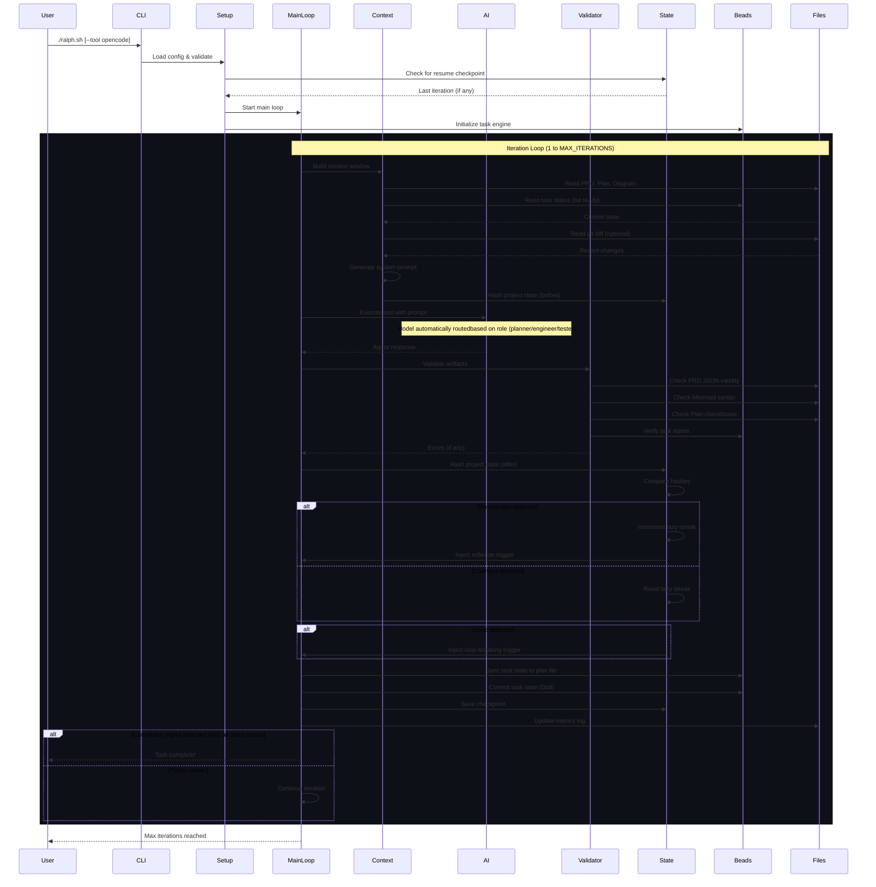
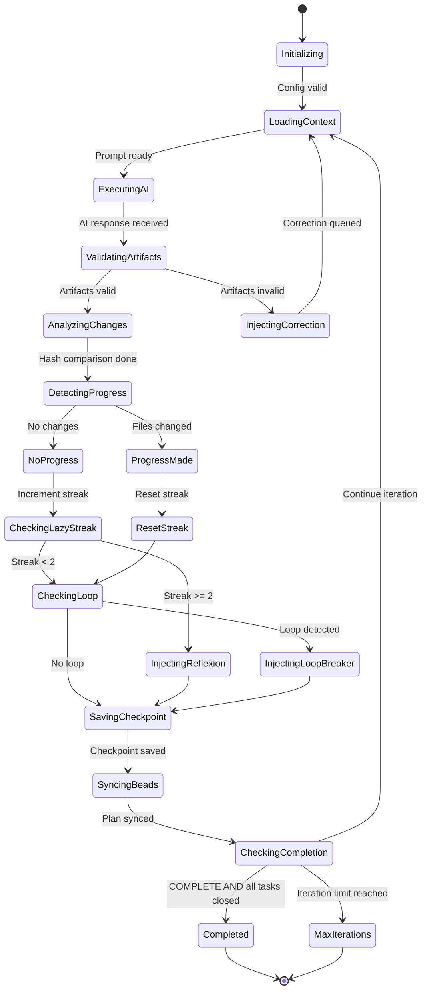
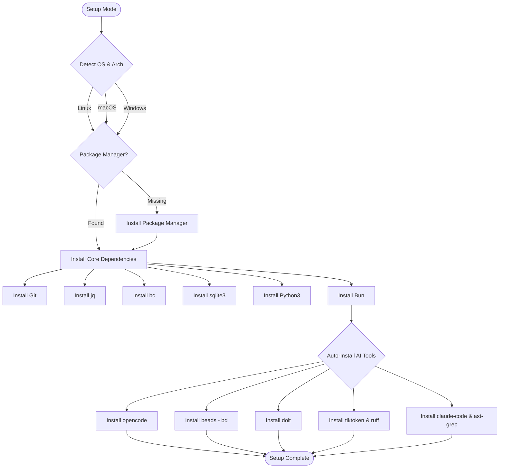
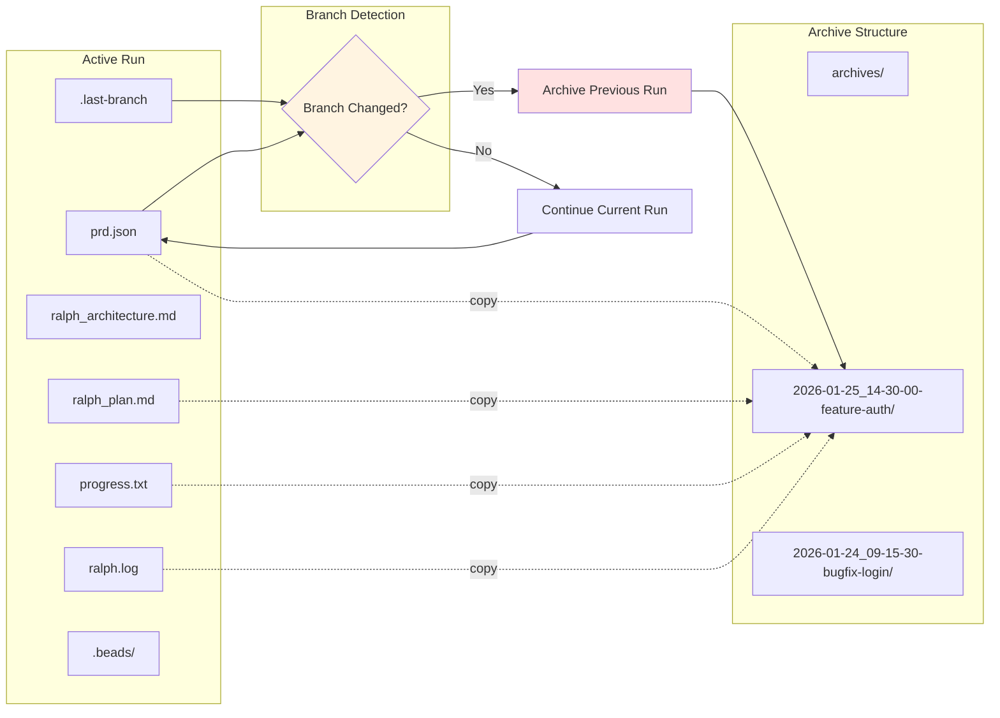
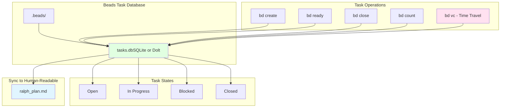
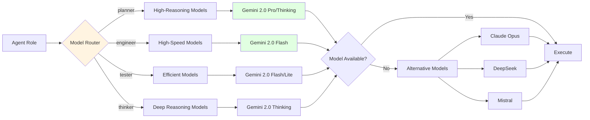

# Ralph Wiggum Agent Architecture

Ralph is a sophisticated autonomous AI agent system that uses "Grounded Architecture" principles to maintain consistency across three key artifacts (PRD, Plan, Diagram) while employing reflexion techniques to detect and break out of unproductive loops.

## System Overview


```mermaid
graph TB
    subgraph "Entry Point"
        CLI[Command Line Interface]
        Config[Configuration Loading]
    end
    
    subgraph "Setup & Validation"
        Setup[Setup Mode]
        Deps[Dependency Installer]
        Validate[Config Validator]
    end
    
    subgraph "Core State Management"
        PRD["prd.json<br/>goals & requirements"]
        BeadsDB[".ralph/beads/tasks.db<br/>task database"]
        Plan["ralph_plan.md<br/>human-readable tasks"]
        Diagram["ralph_architecture.md<br/>mermaid diagrams"]
        Progress["progress.txt<br/>run metadata"]
        Checkpoint[".ralph_checkpoint<br/>resume point"]
    end
    
    subgraph "Iteration Engine"
        Loop[Main Loop Controller]
        Context[Context Builder]
        Prompt[System Prompt Generator]
        AITool[AI Tool Executor]
        Validator[Artifact Validator]
        Analysis[Post-Execution Analysis]
    end
    
    subgraph "AI Tool Integration"
        OpenCode[opencode - Primary]
        AMP[amp - Anthropic MCP]
        Claude[claude-cli]
        Agy[agy - Google Antigravity]
        Codex[codex - OpenAI]
        Copilot[GitHub Copilot]
    end
    
    subgraph "Task Management"
        Beads[Beads CLI - bd]
        Dolt[Dolt - Time Travel]
        SQLite[SQLite Backend]
    end
    
    subgraph "State Detection"
        HashBefore[Pre-Hash Calculator]
        HashAfter[Post-Hash Calculator]
        LoopDetect[Loop Detection]
        LazyDetect[Lazy Detection]
    end
    
    subgraph "Reflexion System"
        Trigger[Reflexion Trigger]
        Correction[Error Correction]
        Steering[User Steering]
    end
    
    subgraph "Compounding Memory (.ralph/artifacts, cross-run)"
        Signals["signals/*.json<br/>deduped recurring problems<br/>freq · severity · related[]"]
        LogMd["LOG.md<br/>append-only narrative"]
        Skills["skills/*.json<br/>proven resolutions<br/>candidate to approved"]
        GlobalSkills["~/.config/ralph/skills<br/>cross-project skills"]
        GenMemory["~/.config/ralph/memory<br/>genetic lessons"]
    end

    subgraph "Curator Pass (review_run · --review/--once)"
        Prune["prune signals/skills (TTL)"]
        LinkRel[link_related_signals]
        Lint["lint: gaps / orphaned /<br/>stale / high-severity"]
        Tune["self-tune LAZY_THRESHOLD"]
    end

    subgraph "Swarm (bounded scheduler)"
        Spawn["spawn_agent + slot gate"]
        Reap[reap dead agents]
        SoO["soo: plan to drain<br/>+ retry/cycle cap"]
        WarRoom["war-room event bus"]
        SwarmHist[run history]
    end

    subgraph "Triggers & Durability"
        Once["--once / backlog-drain"]
        Review["--review"]
        Unattended["--unattended (sandbox)"]
        Retry["retry + backoff"]
        Breaker["circuit breaker"]
        Recovery["recovery checkpoint"]
        RunDir[".ralph/runs/RUN_ID<br/>step traces"]
    end
    
    subgraph "Utilities"
        Git[Git Operations]
        Archive[Archive Manager]
        Logger[Logging System]
        Metrics[Metrics Tracker]
    end
    
    CLI --> Config
    Config --> Setup
    Config --> Validate
    
    Setup --> Deps
    Deps --> OpenCode
    Deps --> AMP
    Deps --> Claude
    Deps --> Copilot
    Deps --> Beads
    Deps --> Dolt
    
    Validate --> Loop
    
    Loop --> Context
    Context --> PRD
    Context --> BeadsDB
    Context --> Plan
    Context --> Diagram
    Context --> Git
    Context --> GenMemory
    Context --> WarRoom
    
    Context --> Prompt
    Prompt --> AITool
    
    AITool --> OpenCode
    AITool --> AMP
    AITool --> Claude
    AITool --> Agy
    AITool --> Codex
    AITool --> Copilot
    
    BeadsDB --> Dolt
    BeadsDB --> SQLite
    Beads --> BeadsDB
    
    AITool --> Validator
    Validator --> PRD
    Validator --> Plan
    Validator --> Diagram
    
    Validator --> Analysis
    
    Analysis --> HashBefore
    Analysis --> HashAfter
    HashAfter --> LazyDetect
    HashAfter --> LoopDetect
    
    LazyDetect --> Trigger
    LoopDetect --> Trigger
    Validator --> Correction
    
    Trigger --> Loop
    Correction --> Loop
    Steering --> Loop
    
    Loop --> Checkpoint
    Loop --> Progress
    Loop --> Metrics
    Loop --> Logger
    
    Archive --> PRD
    Archive --> Plan
    Archive --> Progress

    %% Compounding memory: recalled into context, captured from analysis
    Context --> Signals
    Context --> Skills
    Context --> LogMd
    Analysis --> Signals
    Signals --> Skills
    Skills --> GlobalSkills
    GlobalSkills --> Skills
    Analysis --> LogMd

    %% Triggers & durability around the loop / AI call
    Once --> Loop
    Review --> Loop
    Unattended --> Loop
    Retry --> AITool
    Breaker --> Loop
    Loop --> Recovery
    Loop --> RunDir

    %% Curator pass (review_run) maintains the compounding layer
    Loop --> Prune
    Loop --> LinkRel
    Loop --> Lint
    Loop --> Tune
    LinkRel --> Signals
    Lint --> Signals
    Lint --> Skills
    Tune --> LazyDetect

    %% Swarm bounded scheduler
    Loop --> Spawn
    SoO --> Spawn
    Spawn --> Reap
    Spawn --> WarRoom
    Spawn --> SwarmHist

    style PRD fill:#e1f5ff
    style BeadsDB fill:#e1f5ff
    style Plan fill:#e1f5ff
    style Diagram fill:#e1f5ff
    style Loop fill:#fff4e1
    style AITool fill:#f0e1ff
    style Trigger fill:#ffe1e1
    style Beads fill:#e1ffe1
    style GenMemory fill:#ffe1f0
    style Signals fill:#fff0d0
    style Skills fill:#fff0d0
    style GlobalSkills fill:#fff0d0
    style LogMd fill:#fff0d0
    style Lint fill:#e1ffe1
    style LinkRel fill:#e1ffe1
    style SoO fill:#f0e1ff
```

## Data Flow Sequence


```mermaid
sequenceDiagram
    participant User
    participant CLI
    participant Setup
    participant MainLoop
    participant Context
    participant AI
    participant Validator
    participant State
    participant Beads
    participant Files

    User->>CLI: ./ralph.sh [--tool opencode]
    CLI->>Setup: Load config & validate
    Setup->>State: Check for resume checkpoint
    State-->>Setup: Last iteration (if any)
    
    Setup->>MainLoop: Start main loop
    Setup->>Beads: Initialize task engine
    
    rect rgb(13, 17, 23)
        Note over MainLoop,Files: Iteration Loop (1 to MAX_ITERATIONS)
        
        MainLoop->>Context: Build context window
        Context->>Files: Read PRD, Plan, Diagram
        Context->>Beads: Read task status (bd ready)
        Files-->>Context: Current state
        Context->>Files: Read git diff (optional)
        Files-->>Context: Recent changes
        
        Context->>Context: Generate system prompt
        Context->>State: Hash project state (before)
        
        MainLoop->>AI: Execute tool with prompt
        Note over AI: Model automatically routedbased on role (planner/engineer/tester)
        AI-->>MainLoop: Agent response
        
        MainLoop->>Validator: Validate artifacts
        Validator->>Files: Check PRD JSON validity
        Validator->>Files: Check Mermaid syntax
        Validator->>Files: Check Plan checkboxes
        Validator->>Beads: Verify task states
        Validator-->>MainLoop: Errors (if any)
        
        MainLoop->>State: Hash project state (after)
        State->>State: Compare hashes
        
        alt No changes detected
            State->>State: Increment lazy streak
            State->>MainLoop: Inject reflexion trigger
        else Changes detected
            State->>State: Reset lazy streak
        end
        
        alt Loop detected
            State->>MainLoop: Inject loop-breaking trigger
        end
        
        MainLoop->>Beads: Sync task state to plan file
        MainLoop->>Beads: Commit task state (Dolt)
        MainLoop->>State: Save checkpoint
        MainLoop->>Files: Update metrics log
        
        alt Completion signal detected AND all tasks closed
            MainLoop-->>User: Task complete!
        else Tasks remain
            MainLoop->>MainLoop: Continue iteration
        end
    end
    
    MainLoop-->>User: Max iterations reached
```

## State Tracking & Reflexion


```mermaid
stateDiagram-v2
    [*] --> Initializing
    Initializing --> LoadingContext: Config valid
    
    LoadingContext --> ExecutingAI: Prompt ready
    
    ExecutingAI --> ValidatingArtifacts: AI response received
    
    ValidatingArtifacts --> AnalyzingChanges: Artifacts valid
    ValidatingArtifacts --> InjectingCorrection: Artifacts invalid
    
    InjectingCorrection --> LoadingContext: Correction queued
    
    AnalyzingChanges --> DetectingProgress: Hash comparison done
    
    DetectingProgress --> ProgressMade: Files changed
    DetectingProgress --> NoProgress: No changes
    
    NoProgress --> CheckingLazyStreak: Increment streak
    ProgressMade --> ResetStreak: Reset streak
    
    CheckingLazyStreak --> InjectingReflexion: Streak >= 2
    CheckingLazyStreak --> CheckingLoop: Streak < 2
    
    ResetStreak --> CheckingLoop
    
    CheckingLoop --> InjectingLoopBreaker: Loop detected
    CheckingLoop --> SavingCheckpoint: No loop
    
    InjectingReflexion --> SavingCheckpoint
    InjectingLoopBreaker --> SavingCheckpoint
    
    SavingCheckpoint --> SyncingBeads: Checkpoint saved
    
    SyncingBeads --> CheckingCompletion: Plan synced
    
    CheckingCompletion --> Completed: COMPLETE AND all tasks closed
    CheckingCompletion --> LoadingContext: Continue iteration
    CheckingCompletion --> MaxIterations: Iteration limit reached
    
    Completed --> [*]
    MaxIterations --> [*]
```

## Dependency Installation Flow


```mermaid
flowchart TD
    Start([Setup Mode]) --> DetectOS{Detect OS & Arch}
    
    DetectOS -->|Linux| CheckPkgMgr
    DetectOS -->|macOS| CheckPkgMgr
    DetectOS -->|Windows| CheckPkgMgr
    
    CheckPkgMgr{Package Manager?}
    CheckPkgMgr -->|Found| InstallCore
    CheckPkgMgr -->|Missing| InstallPkgMgr[Install Package Manager]
    
    InstallPkgMgr --> InstallCore
    
    InstallCore[Install Core Dependencies]
    InstallCore --> Git[Install Git]
    InstallCore --> JQ[Install jq]
    InstallCore --> BC[Install bc]
    InstallCore --> SQLite[Install sqlite3]
    InstallCore --> Python[Install Python3]
    InstallCore --> Bun[Install Bun]
    
    Bun --> PromptAI
    
    PromptAI{Auto-Install AI Tools}
    
    PromptAI --> InstallOpenCode[Install opencode]
    PromptAI --> InstallBeads[Install beads - bd]
    PromptAI --> InstallDolt[Install dolt]
    PromptAI --> InstallPython[Install tiktoken & ruff]
    PromptAI --> InstallNode[Install claude-code & ast-grep]
    
    InstallOpenCode --> Complete([Setup Complete])
    InstallBeads --> Complete
    InstallDolt --> Complete
    InstallPython --> Complete
    InstallNode --> Complete
```

## File Management & Archiving


```mermaid
graph LR
    subgraph "Active Run"
        PRD1[prd.json]
        Plan1[ralph_plan.md]
        Diagram1[ralph_architecture.md]
        Progress1[progress.txt]
        Log1[ralph.log]
        Branch1[.last-branch]
        Beads1[.beads/]
    end
    
    subgraph "Branch Detection"
        Check{Branch Changed?}
    end
    
    subgraph "Archive Structure"
        ArchiveDir[archives/]
        Date1[2026-01-25_14-30-00-feature-auth/]
        Date2[2026-01-24_09-15-30-bugfix-login/]
    end
    
    Branch1 --> Check
    PRD1 --> Check
    
    Check -->|Yes| Archive[Archive Previous Run]
    Check -->|No| Continue[Continue Current Run]
    
    Archive --> Date1
    PRD1 -.copy.-> Date1
    Plan1 -.copy.-> Date1
    Progress1 -.copy.-> Date1
    Log1 -.copy.-> Date1
    
    Continue --> PRD1

    style Check fill:#fff4e1
    style Archive fill:#ffe1e1
```

## Task Management with Beads


```mermaid
graph TD
    subgraph "Beads Task Database"
        BeadsRoot[.beads/]
        DB[tasks.dbSQLite or Dolt]
    end
    
    subgraph "Task Operations"
        Create[bd create]
        List[bd ready]
        Close[bd close]
        Status[bd count]
        VC[bd vc - Time Travel]
    end
    
    subgraph "Task States"
        Open[Open]
        InProgress[In Progress]
        Blocked[Blocked]
        Closed[Closed]
    end
    
    subgraph "Sync to Human-Readable"
        PlanFile[ralph_plan.md]
    end
    
    BeadsRoot --> DB
    
    Create --> DB
    List --> DB
    Close --> DB
    Status --> DB
    VC --> DB
    
    DB --> Open
    DB --> InProgress
    DB --> Blocked
    DB --> Closed
    
    DB --> PlanFile
    
    style DB fill:#e1ffe1
    style PlanFile fill:#e1f5ff
    style VC fill:#ffe1f0
```

## Intelligent Model Routing


```mermaid
flowchart LR
    Start[Agent Role] --> Router{Model Router}
    
    Router -->|planner| Planner[High-Reasoning Models]
    Router -->|engineer| Engineer[High-Speed Models]
    Router -->|tester| Tester[Efficient Models]
    Router -->|thinker| Thinker[Deep Reasoning Models]
    
    Planner --> GeminiPro[Gemini 2.0 Pro/Thinking]
    Engineer --> GeminiFlash[Gemini 2.0 Flash]
    Tester --> GeminiLite[Gemini 2.0 Flash/Lite]
    Thinker --> GeminiThinking[Gemini 2.0 Thinking]
    
    GeminiPro --> Fallback{Model Available?}
    GeminiFlash --> Fallback
    GeminiLite --> Fallback
    GeminiThinking --> Fallback
    
    Fallback -->|No| Alternative[Alternative Models]
    Fallback -->|Yes| Execute[Execute]
    
    Alternative --> Opus[Claude Opus]
    Alternative --> DeepSeek[DeepSeek]
    Alternative --> Mistral[Mistral]
    
    Opus --> Execute
    DeepSeek --> Execute
    Mistral --> Execute
    
    style Router fill:#fff4e1
    style GeminiPro fill:#e1ffe1
    style GeminiFlash fill:#e1ffe1
```

## Key Features

### 1. Grounded Architecture
Ralph maintains synchronized artifacts for consistent execution:
- **prd.json**: Product requirements in JSON format
- **ralph_plan.md**: Human-readable execution plan synced from Beads
- **ralph_architecture.md**: Mermaid diagrams of system architecture
- **AGENTS.md**: Project-specific instructions and conventions (highly effective for agent alignment)

### 2. Time-Travel Task Management
- Uses **Beads** (`bd` CLI) for dependency-aware task tracking
- Optional **Dolt** backend provides git-like version control for tasks
- Full task history and ability to replay states
- Tasks automatically synced to human-readable plan file

### 3. Intelligent Model Routing (dynamic, tool-aware)
- Resolves the model **live, per tool + role** — preferring each tool's own source over any pinned string (`resolve_model_for_tool`):
  - **agy** (Google Antigravity — the gemini CLI is deprecated/archived): live-lists via `agy models` and picks the newest model for the role (e.g. Planner → newest reasoning tier like Claude Opus 4.6; Tester → an efficient flash tier); empty ⇒ agy auto-selects latest.
  - **claude / amp**: tier **aliases** (`opus` for planner/thinker, `sonnet` otherwise) that resolve to the latest server-side — never a pinned date.
  - **opencode**: dynamic discovery via the `opencode models` router.
- Role tiers and "newest" are chosen by version (dominant) then capability keyword; `RALPH_MODEL_FAMILIES` still tunes opencode family preference.
- No hardcoded `…-2.0-…`/dated-model pins on the hot path.

### 4. Reflexion & Loop Detection
- **Lazy Detection**: Identifies when agent isn't making progress (no file changes)
- **Loop Detection**: Catches repetitive actions via log signature analysis
- **Automatic Correction**: Injects reflexion prompts to break unproductive patterns
- **User Steering**: Interactive mode for mid-iteration guidance

### 5. Genetic Memory
- Persists engineering lessons across projects
- Stored in `~/.config/ralph/memory/global.json`
- Automatically recalls relevant patterns
- Helps avoid repeating mistakes

### 6. Self-Healing Tooling
- Auto-detects missing dependencies (pytest, npm, cargo, etc.)
- Attempts autonomous installation via `ralph setup`
- Graceful degradation when tools unavailable

### 7. War Room Coordination
- Real-time event system for multi-agent coordination
- Message passing between agents
- Task board for swarm orchestration

### 8. Compounding Artifact Layer
- **Signals**: deduplicated "patterns the loop keeps re-hitting" — one git-diffable JSON per signal under `.ralph/artifacts/signals/`, keyed by a normalized `theme_key`, with frequency, severity, and lifecycle (open → ack → resolved, auto-reopen on regression). A bounded digest is surfaced into the prompt each iteration. Signals that recur in the same run are linked (`related`), so recall surfaces *clusters* of problems that tend to appear together.
- **LOG.md**: an append-only cross-run narrative at `.ralph/artifacts/LOG.md`.
- **Guarded Skills**: when a recurring signal is resolved with a note, Ralph auto-authors a *candidate* skill (a proven resolution). Candidates are never surfaced until you `approve` them; approved skills are then injected ("you fixed this before: …") whenever the matching signal is open again. An approved skill can be **`globalize`d** into a HOME-global store so the proven fix is recalled in *every* repo (mirrors genetic memory; project-local skills take precedence).
- Manage via the `ralph signal`, `ralph skill`, and `ralph lint` (read-only knowledge-hygiene curator: gaps, orphaned/stale skills, approval backlog, unresolved high-severity) CLIs (see Usage).

### 9. Durable Execution & Bounded Orchestration
- **Retry/backoff** around the AI call, plus **recovery checkpoints** persisted per run so `--resume` can continue after a crash.
- **Failure ≠ done**: a failed iteration never counts as success, and a **circuit breaker** stops the loop after repeated hard failures.
- **Triggers**: `--once` (single pass), backlog-drain (stop once the task queue stays empty for a streak), and a `--review` self-tuning pass that adjusts the lazy-detection threshold from run metrics.
- **Per-run workspace**: each run gets a `RUN_ID` and a `.ralph/runs/<id>/` directory with step traces; old runs are pruned.
- **Bounded swarm scheduler**: live-PID-aware concurrency cap, dead-agent reaping, run history, and per-task + global retry caps so orchestration can't loop forever.

## Usage

### Basic Usage
```bash
# Run with default tool (opencode)
./ralph.sh

# Specify a tool
./ralph.sh --tool opencode
./ralph.sh --tool amp
./ralph.sh --tool claude
./ralph.sh --tool agy       # Google Antigravity
./ralph.sh --tool codex     # OpenAI Codex (codex exec, sandboxed)

# Specify model
./ralph.sh --model "google/gemini-2.0-flash-001"

# Set max iterations
./ralph.sh --max-iterations 20

# Resume from checkpoint
./ralph.sh --resume

# Interactive mode (pause between iterations)
./ralph.sh --interactive

# Run internal tests
./ralph.sh --test

# Single pass (one iteration) then exit — ideal for cron/CI triggers
./ralph.sh --once

# Self-tuning review pass: refresh the lazy threshold from run metrics (no AI call)
./ralph.sh --review

# Unattended: never pause for input (headless/cron runs)
./ralph.sh --unattended

# Run in Docker sandbox
./ralph.sh --sandbox

# Add context files
./ralph.sh --context docs/api.md --context lib/utils.sh

# Include recent git diffs in context
./ralph.sh --diff-context

# Disable archiving
./ralph.sh --no-archive
```

### Copilot Integration
```bash
# Run an agentic task with Copilot
./ralph.sh copilot run "Refactor the login function"

# Ask for an explanation
./ralph.sh copilot explain "How does the event bus work?"

# Authenticate Copilot
./ralph.sh copilot auth
```

### Setup
```bash
# Auto-install all dependencies
./ralph.sh --setup

# Initialize a new project
./ralph.sh --init
```

### Task Management
```bash
# Create a task
bd create "Implement user authentication" -d "Add JWT-based auth" --deps "tk-001"

# List ready tasks (unblocked)
bd ready

# Close a task
bd close tk-123

# View task history (with Dolt)
bd vc log
```

### Compounding Memory (Signals & Skills)
```bash
# Signals — recurring problems the loop keeps hitting
./ralph.sh signal ls                                    # list, most urgent first
./ralph.sh signal show <key>                            # inspect one signal
./ralph.sh signal resolve <key> "added the missing module"  # resolve (may auto-author a skill)
./ralph.sh signal recall                                # the digest surfaced to the agent

# Skills — proven resolutions; candidates stay hidden until approved
./ralph.sh skill ls
./ralph.sh skill approve <theme>     # surface this fix when the matching signal recurs
./ralph.sh skill reject <theme>
./ralph.sh skill globalize <theme>   # promote a proven fix to the cross-repo store (recalled in EVERY project)
./ralph.sh skill global              # list global (cross-project) skills

# Lint — periodic curator sweep over the knowledge store (read-only)
./ralph.sh lint                      # knowledge gaps, orphaned/stale skills, approval backlog, high-severity
```

### Swarm Commands
```bash
# Spawn a sub-agent
./ralph.sh swarm spawn --role "Frontend Developer" --task "Build UI"

# Send message to agent
./ralph.sh swarm msg --to agent-123 --content "Status update?"

# List all agents
./ralph.sh swarm list

# Series of Orchestrations: auto-plan then drain the task queue with bounded workers
./ralph.sh swarm soo

# Reap crashed agents / view the run history
./ralph.sh swarm reap
./ralph.sh swarm history
```

## Configuration

### Environment Variables
- `TOOL`: AI tool to use (opencode, claude, amp, agy, codex)
- `RALPH_ROLE`: Role driving model routing — `planner` | `engineer` (default) | `tester` | `thinker`
- `SELECTED_MODEL`: Specific model to pin (honored from CLI `--model`, `ralph.json`, `.ralphrc`, or this env var; otherwise auto-selected per tool+role)
- `MAX_ITERATIONS`: Maximum iterations (default: 10)
- `LOG_FILE`: Path to log file (default: ralph.log)
- `VERBOSE`: Enable debug logging (true/false)
- `RALPH_UNATTENDED`: Autonomous mode (same as `--unattended`) — prefers the Docker sandbox for isolation and suppresses interactive prompts (e.g. sudo). For interactive pausing between iterations use `-i/--interactive`
- `RALPH_TOOL_TIMEOUT`: Per-iteration wall-clock cap (seconds) for the AI tool call; the loop is wrapped in `timeout`/`gtimeout` so a hung tool can't block it (default 1800; `0` removes Ralph's wrapper — note agy still self-terminates at its built-in ~5m `--print` default; set a large value to extend instead)
- `AI_RETRY_ATTEMPTS` / `AI_RETRY_BASE_DELAY`: Retry count / base backoff (s) for a failed tool call (default 3 / 5)
- `MAX_CONSECUTIVE_FAILURES`: Consecutive failed iterations before the loop aborts (default 3)
- `RALPH_RESUME_SESSION`: Opt-in (`1`) session continuity — resume the tool's conversation across iterations (same as `--continue-session`). Supported on claude/opencode/agy (`--continue`); codex/amp run fresh each iteration. Default off (each iteration is freshly grounded). Spans iterations of a single run only — **not** across separate `--once`/cron ticks (the session-established flag is per-process)
- `RALPH_MAX_BUDGET_USD`: Opt-in per-call spend cap for `--tool claude` (`--max-budget-usd`); unset = no cap
- `RALPH_CLAUDE_FALLBACK_MODEL`: Tier claude falls back to on overload (default `sonnet`; skipped when it equals the primary). For `--tool claude`, do NOT set `ANTHROPIC_BASE_URL` unless you want a local/proxy endpoint — claude uses your normal Anthropic auth by default
- `LAZY_THRESHOLD`: Iterations without file changes before a reflexion nudge (auto-tuned by `--review`)
- `RALPH_HASH_EXCLUDES`: Extra dir names to exclude from the project hash (also reads `.ralph/excludes`)
- `GITDIFF_EXCLUDE`: Path to the diff-exclude file used by `--diff-context` (default: `gitdiff-exclude`)
- `RALPH_HEALTH_PORTS` / `RALPH_MODEL_FAMILIES` / `RALPH_SANDBOX_ALLOW_ENV`: Override the built-in port / model-family / sandbox-env-passthrough lists
- `RALPH_SIGNAL_RECALL` / `RALPH_SIGNAL_OPEN_TTL_DAYS`: Signal digest size / prune age for open signals
- `RALPH_SIGNAL_RELATED_MAX`: Max co-occurrence (`related`) links stored/surfaced per signal (default 8)
- `RALPH_SKILL_MIN_FREQ` / `RALPH_SKILL_RECALL` / `RALPH_SKILL_TTL_DAYS`: Skill auto-capture frequency threshold / recall size / prune age
- `RALPH_LINT_MIN_FREQ` / `RALPH_LINT_STALE_DAYS`: Knowledge-lint gap-frequency threshold / stale-skill idle age
- `RALPH_GLOBAL_SKILL_DIR`: Cross-project (HOME-global) skill store (default: `~/.config/ralph/skills`)
- `RALPH_SWARM_MAX_CONCURRENT` / `RALPH_SWARM_MAX_RETRIES` / `RALPH_SWARM_MAX_CYCLES` / `RALPH_SWARM_SLOT_TIMEOUT` / `RALPH_SWARM_ROOT`: Swarm scheduler bounds and state location

### Configuration File
Ralph supports `ralph.json` (JSON) or `.ralphrc` (shell) for persistent settings.
Priority: command-line args > `.ralphrc` > `ralph.json` > defaults.

`ralph.json` keys: `tool`, `model`, `maxIterations`, `sandbox`, `verbose`:

```json
{
  "tool": "opencode",
  "model": "",
  "maxIterations": 15,
  "sandbox": false,
  "verbose": true
}
```

## Testing
```bash
# Run every suite (9 unit harnesses + the native --test) — 250 cases total
./tests/run_all.sh

# Just the native runtime self-test
./ralph.sh --test
```
Each suite is hermetic (sources `lib/*.sh`, uses `mktemp` sandboxes). See
[`tests/README.md`](tests/README.md) for the per-suite breakdown.

## Required Dependencies

### Core
- bash (4.0+)
- git
- jq
- curl
- bc
- sqlite3
- python3
- bun (preferred) or npm

### AI Tools (at least one)
- opencode (recommended)
- amp (Anthropic MCP)
- claude-cli

### Task Management
- bd (beads) - installed via `go install`
- dolt (optional) - for time-travel capabilities

### Optional
- docker (for sandbox mode)
- ruff (Python linting)
- ast-grep (code analysis)
- tiktoken (accurate token counting)

## Architecture Principles

### Cognitive Process
Every agent response follows:
1. **Reflect**: Analyze recent changes and context
2. **Plan**: Identify next unblocked task from Beads
3. **Reason**: Determine efficient tool-path
4. **Anticipate**: Identify potential side effects

### Verification Mandatory
- All code changes require tests
- Tasks not closed until tests pass
- Runtime verification for services
- Architectural integrity checks

### Constraints
- **Diagram First**: Update architecture before complex features
- **Valid Artifacts**: Ensure JSON and Mermaid validity
- **No Loops**: Detect and break unproductive cycles
- **Termination**: Only signal completion when all tasks closed

## Project Structure

```
.
├── ralph.sh                  # Main entry point
├── lib/
│   ├── utils.sh             # Utility functions
│   ├── engine.sh            # Core iteration engine
│   └── tools.sh             # Tool integrations
├── prd.json                 # Product requirements
├── AGENTS.md                # Project-specific instructions
├── ralph_plan.md            # Execution plan (synced from Beads)
├── ralph_architecture.md    # System diagrams
├── progress.txt             # Run metadata
├── ralph.log                # Execution log
├── .ralph_checkpoint        # Resume state
├── .last-branch             # Branch tracking
├── .beads/                  # Task database
│   └── tasks.db             # SQLite or Dolt
└── archives/                # Previous runs
    └── 2026-01-28_10-30-00-feature/
```

## Advanced Features

### Context Windowing
Ralph intelligently manages context window size:
- Prioritizes recent and relevant information
- Compresses older context
- Maintains critical artifacts in full

### Token Estimation
Multiple estimation methods:
- Simple (chars/4)
- Advanced (heuristic with code detection)
- tiktoken (accurate, requires Python library)

### Runtime Verification
Automatically identifies and verifies:
- Rust projects (`cargo check`)
- Node.js projects (package.json validation)
- Python projects (`ruff check`)
- Go projects (`go vet`)
- Running services (health checks, benchmarks)

### Performance Monitoring
- Tracks iteration metrics
- Monitors lazy streaks
- Logs token usage
- Detects performance regressions

## Troubleshooting

### Agent Making No Progress
- Check `ralph.log` for errors
- Review lazy streak counter
- Enable `--interactive` mode for steering
- Try different role or model

### Tasks Not Closing
- Verify tests are passing
- Check `bd ready` for blockers
- Review task dependencies

### Model Not Available
- Check `opencode models` for available options
- Specify model explicitly with `--model`
- Fallback chain will try alternatives

### Memory Issues
- Reduce `MAX_ITERATIONS`
- Enable archiving to clear old runs
- Check for large excluded directories

## Contributing

Ralph is designed to be extensible:
- Add new AI tools in `lib/tools.sh`
- Extend validation in `lib/engine.sh`
- Add new roles in `get_role_instructions()`
- Implement new features as skills

## License

See LICENSE file for details.