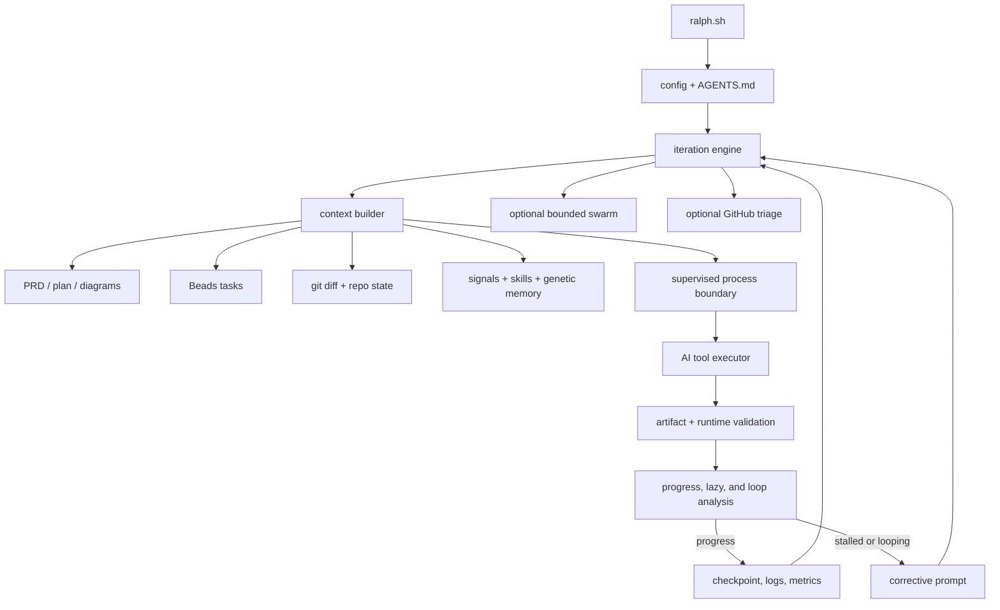
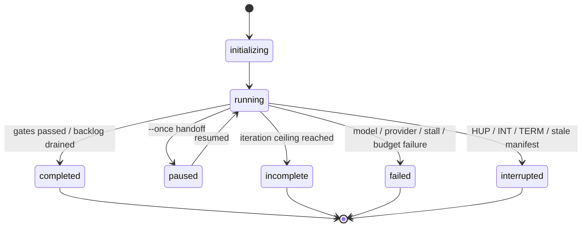
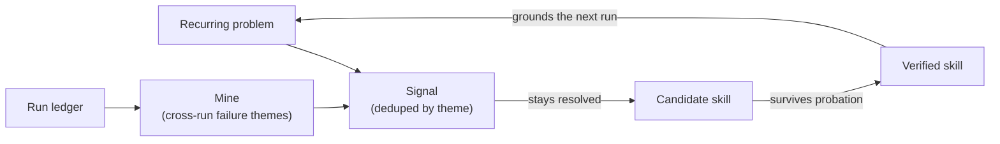
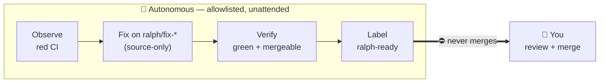

# Ralph

Ralph is a long-running autonomous agent loop for software projects. It keeps an AI coding tool grounded in project artifacts, task state, logs, and recent changes; detects stalls or loops; and can resume, retry, and coordinate bounded multi-agent work.

Use Ralph when you want an agent to keep working from a persistent plan instead of a single prompt.

> **Contributing or curious about the *why*?** See [docs/DESIGN.md](docs/DESIGN.md) — the
> design decisions, the reasoning, the recurring principles (fail-open vs fail-closed,
> verification gates, the "autonomous up to the merge" trust boundary), and the lessons
> learned the hard way.

## What Ralph Does

- Runs an iterative agent loop through tools such as `opencode`, `claude`, `amp`, `agy`, `codex`, `jules`, `jules-cli`, and GitHub Copilot.
- Grounds each iteration in project instructions, Beads task state, run artifacts, git context, and optional extra context files.
- Detects lazy/no-op iterations and repeated loop signatures, then injects corrective prompts.
- Stores recurring problems as signals and promotes proven fixes into guarded skills.
- Supports resumable runs, retry/backoff, circuit breakers, bounded swarm workers, and GitHub triage helpers.

## Quick Start

```bash
# Install or verify dependencies
./ralph.sh --setup

# Initialize Ralph artifacts in a project
./ralph.sh --init

# Run one agent loop with the default tool
./ralph.sh

# Run a single iteration, useful for cron or CI
./ralph.sh --once
```

Run all tests:

```bash
./tests/run_all.sh
```

`./ralph.sh --setup` also installs a `ralph` symlink into `~/.local/bin`, so the commands below use `ralph` from inside your own project.

### Walkthrough: from init to a completed task

A first end-to-end run on a real project.

**1. Scaffold Ralph into the project.**

```bash
cd ~/code/my-project
ralph --init
```

`--init` writes the agent-instructions file your tool reads — `CLAUDE.md` for `--tool claude`, `AGENTS.md` for the others — plus the `.ralph/` state directory. Edit that file so its top section says what *done* means for this project: the build/test commands, the scope, and any house style. It is the operating prompt every iteration is grounded in, so a vague file yields vague work.

**2. Put work on the queue.**

Ralph pulls from a dependency-aware Beads queue via the `bd` CLI:

```bash
bd create "Add a /health endpoint" -d "Return 200 {\"status\":\"ok\"}; add a test"
bd ready          # confirm the task shows up as ready to work
```

No Beads installed? Ralph still runs — it just works from the instructions file and repo state instead of a task queue.

**3. Run the loop.**

```bash
ralph --tool opencode        # or claude / codex / agy / jules / ...
```

Each iteration grounds the agent in the instructions file, the ready Beads tasks, `git diff`, and prior signals/memory; runs the tool; then validates. A productive iteration logs `Files modified - agent is making progress`; a no-op or a repeated loop signature triggers a corrective prompt instead of silently burning iterations.

**4. Completion is earned, not announced.**

Ralph does **not** stop just because the agent claims it is done. A `<promise>COMPLETE</promise>` is honored only when every Beads task is closed, the declared verification commands pass, and the quality gate reads `Quality Gate: pass`. Otherwise the loop injects a "completion blocked" prompt and keeps going. When it genuinely finishes, it early-exits and records the run as `completed`.

**5. Confirm what happened.**

```bash
bd ready          # empty — the queue drained
jq '{run_id, status, reason, current_iteration}' .ralph/runs/latest/run.json
# => { "status": "completed", "reason": "backlog_drained", ... }
```

`reason` is `completion_signal` when the agent's verified `<promise>COMPLETE</promise>` ended the run, or `backlog_drained` when the last ready task closed. For an interrupted or capped run the status is `interrupted`/`incomplete` instead — see [Run Lifecycle Evidence](#run-lifecycle-evidence).

## How It Fits Together


```mermaid
flowchart TD
    CLI["ralph.sh"] --> Config["config + AGENTS.md"]
    Config --> Loop["iteration engine"]

    Loop --> Context["context builder"]
    Context --> Artifacts["PRD / plan / diagrams"]
    Context --> Tasks["Beads tasks"]
    Context --> Git["git diff + repo state"]
    Context --> Memory["signals + skills + genetic memory"]

    Context --> Boundary["supervised process boundary"]
    Boundary --> Tool["AI tool executor"]
    Tool --> Validate["artifact + runtime validation"]
    Validate --> Analyze["progress, lazy, and loop analysis"]

    Analyze -->|progress| Persist["checkpoint, logs, metrics"]
    Analyze -->|stalled or looping| Reflexion["corrective prompt"]
    Reflexion --> Loop
    Persist --> Loop

    Loop --> Swarm["optional bounded swarm"]
    Loop --> Triage["optional GitHub triage"]
```

Ralph revolves around a few durable files and stores:

| Path | Purpose |
|------|---------|
| `AGENTS.md` | Project-specific agent instructions. |
| `prd.json` | Product requirements, when the target project uses Ralph-managed requirements. |
| `ralph_plan.md` | Human-readable task plan synced from Beads. |
| `ralph_architecture.md` | Architecture notes and Mermaid diagrams. |
| `.ralph_checkpoint` | Resume point for interrupted runs. |
| `.ralph/runs/<run-id>/` | Per-run traces and recovery data. |
| `.ralph/runs/<run-id>/run.json` | Atomic lifecycle manifest with monotonic heartbeat sequence, progress, limits, resume lineage, and terminal outcome. |
| `.ralph/runs/<run-id>/steps/iter-N/provider-summary.json` | Redacted per-iteration provider summary with outcome, operator action, transcript signals, evidence filenames, and verification/change status. |
| `.ralph/runs/<run-id>/process-cleanup.json` | Bounded, sanitized, allowlisted provider/live-smoke cleanup latency and escalation evidence. |
| `.ralph/runs/<run-id>/autofix/` | No-change/autofix-failure evidence: diagnostic text, structured outcome, redacted provider summary, local tool log/output path, and source-filter status. |
| `.ralph/runs/<run-id>/providers/` | Provider state such as normalized opencode JSON events or Jules session metadata. |
| `.ralph/artifacts/verification.json` | Ralph-owned evidence for declared verification commands, exit codes, timeouts, and output tails. |
| `.ralph/artifacts/live-smoke.json` | Opt-in live app smoke evidence: command, port, probes, diagnostics, and server log tail. |
| `.ralph/artifacts/signals/` | Deduplicated recurring problems. |
| `.ralph/artifacts/skills/` | Candidate and approved project-local fixes. |
| `~/.config/ralph/skills/` | Optional cross-project skills. |
| `~/.config/ralph/memory/` | Cross-project genetic memory. |

## Run Lifecycle Evidence

Every iterating run writes `.ralph/runs/<run-id>/run.json`. It is an allowlisted operational record: Ralph does not copy environment variables, prompts, provider responses, or secret values into this file.

```bash
jq '{run_id, status, reason, phase, heartbeat_at, heartbeat_sequence, current_iteration, progress}' .ralph/runs/latest/run.json
```

| Status | Meaning |
|--------|---------|
| `initializing` | Run directory and manifest exist; bootstrap is still in progress. |
| `running` | The loop or a local/remote provider is active. |
| `completed` | The completion gates passed or the tracked backlog drained. |
| `paused` | An intentional `--once` scheduler handoff. |
| `incomplete` | The iteration ceiling was reached before completion. |
| `failed` | A model, provider, stall, budget, or unexpected process failure stopped the run. |
| `interrupted` | HUP, INT, TERM, or a stale active manifest from an unclean exit. |


```mermaid
stateDiagram-v2
    [*] --> initializing
    initializing --> running
    running --> completed: gates passed / backlog drained
    running --> paused: --once handoff
    running --> incomplete: iteration ceiling reached
    running --> failed: model / provider / stall / budget failure
    running --> interrupted: HUP / INT / TERM / stale manifest
    paused --> running: resumed
    completed --> [*]
    incomplete --> [*]
    failed --> [*]
    interrupted --> [*]
```

Writes use same-directory temporary files and atomic renames. Heartbeat replacements are serialized, and `heartbeat_sequence` starts at `0` and increments exactly once for each persisted heartbeat. If a process dies before its EXIT trap can finalize, the next singleton run marks the prior active manifest `interrupted` with reason `unclean_exit_detected`, preserves its final heartbeat sequence, and records the recovering run ID.

### Executor Boundaries

Every local AI provider and live-smoke server starts through `lib/process_supervisor.py` in a dedicated Unix session and process group. Before the command is released, Ralph validates a mode-`600` ephemeral handshake against the supervisor PID, process start tokens, parent PID, process-group ID, and session ID. The handshake is then deleted.

Timeout, signal, verification, and parent-death cleanup send TERM to the complete validated group, wait for the configured grace period, and escalate remaining members to KILL. The supervisor preserves the direct command's exit code and does not report completion while in-group descendants remain. This closes late-fork and daemonized-child races that PID-tree snapshots cannot close.

Process groups provide lifecycle ownership, not a security boundary against a deliberately escaping process. Use `--sandbox` when the executor itself is untrusted.

### Reliability Soak

Run a network-free, disposable TERM/KILL recovery cycle against the real entry point:

```bash
tests/unattended_soak.sh --cycles 2 --duration 120 --seed 42 \
  --output /tmp/ralph-soak.json
jq '{status, fault_runs, retention, failures}' /tmp/ralph-soak.json
```

Each cycle injects both signals in seeded random order, resumes from the prior checkpoint, verifies provider-boundary cleanup, cleanup evidence, and stale-manifest reconciliation, and enforces run retention. The mode-`600` JSON report is allowlisted and excludes prompts, logs, environment values, commands, and temporary paths. `--duration` is a wall-clock ceiling checked between cycles; an active cycle always finishes.

## Common Commands

### Agent Loop

```bash
./ralph.sh                         # default tool
./ralph.sh --tool opencode         # choose a tool
./ralph.sh --tool codex            # OpenAI Codex via `codex exec`
./ralph.sh --tool jules            # Jules REST remote executor; requires JULES_API_KEY and a connected source
./ralph.sh --tool jules-cli        # Jules CLI remote executor; uses existing `jules login` OAuth state
./ralph.sh --model "provider/id"   # pin a model
./ralph.sh --max-iterations 20     # change loop limit
./ralph.sh --resume                # resume from checkpoint
./ralph.sh --interactive           # pause between iterations
./ralph.sh --unattended            # no interactive prompts
./ralph.sh --sandbox               # run in Docker sandbox
./ralph.sh --no-sandbox            # explicitly accept host execution
./ralph.sh --context docs/api.md   # add context files
./ralph.sh --diff-context          # include recent git diff
./ralph.sh --review                # self-tuning review pass, no AI call
./ralph.sh --test                  # native runtime self-test
```

Supported AI tools:

| Tool | Notes |
|------|-------|
| `opencode` | Default and recommended general router. |
| `claude` | Uses Claude Code conventions, including `CLAUDE.md` when present. |
| `amp` | Anthropic MCP workflow. |
| `agy` | Google Antigravity CLI. |
| `codex` | OpenAI Codex CLI, executed in sandboxed mode. |
| `jules` | Asynchronous Jules REST executor. PR mode creates/records a remote PR; patch mode applies returned diffs locally. |
| `jules-cli` | Asynchronous Jules CLI executor. Uses the authenticated local `jules` CLI, persists the remote session ID, and pulls/applies completed results. |
| `copilot` | Available through the Copilot subcommands below. |

### Copilot

```bash
./ralph.sh copilot auth
./ralph.sh copilot run "Refactor the login function"
./ralph.sh copilot explain "How does the event bus work?"
```

### Signals, Skills, and Lint

Ralph's memory is a **ratchet**: recurring problems compound into deduped *signals*,
signals that stay resolved become *candidate* skills, candidates that survive a probation
window become **verified** skills, and failure themes are mined across the whole run
ledger. Verified knowledge grounds every future run — so Ralph gets better at your project
the longer it runs.


```mermaid
flowchart LR
    P["Recurring problem"] --> S["Signal<br/>(deduped by theme)"]
    S -->|"stays resolved"| K["Candidate skill"]
    K -->|"survives probation"| V["Verified skill"]
    LG["Run ledger"] --> M["Mine<br/>(cross-run failure themes)"]
    M --> S
    V -->|"grounds the next run"| P
```

```bash
./ralph.sh signal ls
./ralph.sh signal show <key>
./ralph.sh signal resolve <key> "fixed by adding the missing module"
./ralph.sh signal recall

./ralph.sh skill ls
./ralph.sh skill approve <theme>          # blocked until the candidate is verified (see below)
./ralph.sh skill approve <theme> --force  # override the verification gate
./ralph.sh skill reject <theme>
./ralph.sh skill globalize <theme>
./ralph.sh skill global

./ralph.sh lint
```

Signals are recurring issues Ralph keeps seeing. Skills are guarded fixes that can be recalled when matching signals reappear. `lint` is a read-only curator pass over that knowledge store.

A candidate skill is captured from the agent's *self-reported* resolution, so it must earn promotion with evidence rather than its own word. Each candidate serves a **probation**: the `--review` curator invalidates it if its signal regresses (the fix did not hold) and marks it `verified` only once the signal has stayed resolved for `RALPH_SKILL_PROBATION_SECONDS` (default 3 days). `ralph skill approve` refuses an unverified candidate unless you pass `--force` or set `RALPH_SKILL_REQUIRE_VERIFY=0`. Only approved skills are ever recalled, so a bogus fix is caught before it can be re-applied.

### Cleanup latency stats

```bash
./ralph.sh cleanup-stats                 # aggregate across .ralph/runs
./ralph.sh cleanup-stats /path/to/runs   # or an explicit run root
```

`cleanup-stats` is a read-only pass over retained `process-cleanup.json` artifacts. It prints an allowlisted JSON summary — per-kind (`provider`, `live_smoke`) sample count, nearest-rank p50/p95 and maximum duration, and TERM/KILL counts and rates — plus the number of runs scanned and malformed artifacts skipped. It never emits commands, PIDs, prompts, logs, environment values, event timestamps, run ids, or paths outside the run root, and never follows a symlinked run directory or artifact. Override the scanned root with `RALPH_RUN_ROOT`.

### Resource Report

```bash
./ralph.sh resource report
./ralph.sh resource report --max-load1 4 --max-memory-used-pct 80 --max-ralph-bytes 2G --max-run-dirs 500
./ralph.sh resource report --record-history ~/.local/state/ralph/resource-history.jsonl --max-growth-pct 15 --max-slope-pct 5
./ralph.sh resource report --record-history ~/.local/state/ralph/resource-history.jsonl | ./ralph.sh resource summary --history ~/.local/state/ralph/resource-history.jsonl
./ralph.sh resource report | ./ralph.sh resource summary --json
./ralph.sh resource report --max-run-dirs 500 --fail-on-warning
```

`resource report` is a JSON snapshot of Ralph disk footprint, retained run/signal counts, latest patrol log size, system load, memory, Ralph timers, and local Synapse process usage. It is read-only unless `--record-history` or `RALPH_RESOURCE_HISTORY_FILE` is set. Optional budgets populate `budgets`, append structured entries to `warnings`, and set `ok=false` when exceeded. History mode appends compact mode-`600` JSONL snapshots, keeps a bounded retention window, and adds previous-snapshot deltas under `trend`. `--max-growth-pct` turns sudden single-snapshot growth into warnings, while `--max-slope-pct` evaluates the recent history window plus the current sample and warns on sustained percent-per-sample growth. `resource summary` converts a report JSON document into the same compact `normal` / `warning` / `sustained-growth` line used by patrol logs; add `--json` for machine-readable summary output. `--fail-on-warning` still prints the report, then exits `3` when any warning is present.

### Swarm

```bash
./ralph.sh swarm spawn --role "Frontend Developer" --task "Build UI"
./ralph.sh swarm msg --to agent-123 --content "Status update?"
./ralph.sh swarm list
./ralph.sh swarm soo
./ralph.sh swarm reap
./ralph.sh swarm history
```

The swarm scheduler is bounded by concurrency, retry, cycle, and slot-timeout limits so orchestration cannot expand indefinitely.

### GitHub Triage

Ralph can inspect an explicit allowlist of GitHub repositories and record findings as signals:

```bash
RALPH_TARGETS="owner/api,owner/web" ./ralph.sh triage
```

It can also prepare opt-in fixes:

```bash
./ralph.sh triage --fix-ci
./ralph.sh triage --fix-ci --apply --run <run-id>
./ralph.sh triage --fix-security
./ralph.sh triage --resolve-reviews <pr>
./ralph.sh triage --suggest --apply
./ralph.sh triage --tidy --apply          # remove legacy full-body history comments from triage issues
```

**Autonomous up to the merge.** In apply modes (typically on the [org patrol](#public-org-patrol)),
Ralph opens verified `ralph/fix-*` PRs unattended and labels the green, mergeable ones
`ralph-ready` — then **stops**. It never merges, never touches a default branch, and only
ever writes source-only changes on an allowlist. The merge stays your call.


```mermaid
flowchart LR
    subgraph auto["🤖 Autonomous — allowlisted, unattended"]
        direction LR
        O["Observe<br/>red CI"] --> X["Fix on ralph/fix-*<br/>(source-only)"]
        X --> V["Verify<br/>green + mergeable"] --> R["Label<br/>ralph-ready"]
    end
    R ==>|"⛔ never merges"| H["👤 You<br/>review + merge"]
```

`--suggest` keeps ONE idempotent digest issue per repo: it edits the body in place when findings change and, only then, posts a compact `+N new, -M resolved` delta comment (never the full digest), so the issue stays quiet when nothing changes. `--tidy` is a one-time cleanup that deletes Ralph's own pre-delta full-body history comments (dry-run by default; leaves human and delta comments untouched).

Triage is scoped by `RALPH_TARGETS` or a `ralph.targets` file. Autofix paths use `ralph/fix-*` branches and are designed to avoid pushing directly to default branches. Untrusted GitHub content (PR review comments, CI logs, code-scanning descriptions) is fenced as data before it enters any prompt, and self-triage can never rewrite Ralph's own control surface (`lib/`, `ralph.sh`, `scripts/`, config/allowlist).

### `ralph mine` — failure-mining meta-loop

Analyzes the cross-run JSONL ledger (`.ralph/state/metrics.json`) for recurring
failure themes (stall / verify_fail / no_progress / token_blowup).

- `ralph mine` — read-only ranked digest.
- `ralph mine --feed` — also record deduped `ledger_failure` signals (themes recurring across >=2 runs).
- `ralph mine --propose` — also draft a dry-run source-only fix PR for the top theme.
- `ralph mine --propose --apply` — open the `ralph/mine-fix-*` PR (never pushes the default branch).

Knobs: `RALPH_MINE_MIN_FREQ` (3), `RALPH_MINE_WINDOW` (50), `RALPH_MINE_BASELINE` (200),
`RALPH_MINE_TOP` (5), `RALPH_MINE_STALL` (3), `RALPH_MINE_TOKEN_P` (95),
`RALPH_MINE_MAX_LINES` (5000 — caps how many trailing ledger lines are scanned, so the read stays O(N) as `metrics.json` grows).

### `ralph memory` — compounding memory via Synapse

Ralph's verified skills and mined failure themes can compound **across repos** through
Synapse (the org-brain retrieval service):

- `ralph memory --sync` ingests every verified skill and every qualifying mined theme
  (`frequency ≥ 3` across `≥ 2` runs) into Synapse as idempotent documents (stable
  `doc_id`; unchanged items are `replayed`, not re-embedded). The org patrol runs this
  after each **apply-mode** tick (`suggest-apply`, `fix-ci-apply`, `fix-security-apply`);
  read-only modes stay side-effect-free.
- `ralph memory --ground "<query>"` prints a `<synapse_context>` block of prior lessons.
  Fix agents (CI, security, mine-propose) are automatically grounded with this context
  before they act, via `_triage_apply_fix`.

Everything is **fail-open**: if Synapse is unset, unreachable, or erroring, `memory`
does nothing and never blocks a run. Knowledge stays scoped to the current
`SYNAPSE_TENANT`, respecting Synapse's multi-tenant isolation.

### Public Org Patrol

Ralph can run a scheduled local patrol for any GitHub org that the authenticated `gh` user can read. The patrol refreshes a public repo allowlist, checks Synapse, and runs GitHub triage:

```bash
scripts/org-public-targets --org <github-org>
scripts/org-patrol --org <github-org> --mode report
scripts/org-soak-summary --org <github-org>
scripts/org-install-systemd install --org <github-org> --interval 30min
scripts/org-install-systemd install --org <github-org> --interval 30min --cpu-quota 25% --memory-max 1G --io-weight 100
```

Default mode is read-only `report`. Patrols also record compact resource history to `~/.local/state/ralph/<github-org>/resource-history.jsonl` unless `RALPH_ORG_RESOURCE_HISTORY=0` or `--no-resource-history` is used, and each patrol log includes a one-line `resource summary` band: `normal`, `warning`, or `sustained-growth` when slope warnings are present. Each patrol also appends a mode-`600` durable soak artifact to `~/.local/state/ralph/<github-org>/soak-summary.jsonl` unless `RALPH_ORG_SOAK_SUMMARY=0` or `--no-soak-summary` is used; the JSONL rows capture exit status, monotonic elapsed time, wall-clock elapsed time, target count, Synapse result, triage result, resource band/warnings, and the linked patrol log path. `scripts/org-soak-summary --org <github-org>` turns that JSONL into a compact rollup for live-fire sessions, and `--json` emits the same data as a machine-readable artifact. Optional `org-install-systemd` limits write `CPUQuota=`, `MemoryMax=`, and `IOWeight=` into the user service. More active modes are opt-in through `RALPH_ORG_TRIAGE_MODE` or `--mode`: `suggest-apply` opens or updates idempotent triage issues, while `fix-ci-apply` and `fix-security-apply` create `ralph/fix-*` PRs for review. Those code-changing apply modes require a second owner/repo allowlist through `RALPH_ORG_CODE_WRITE_TARGETS` or `--code-write-targets`; Ralph intersects that list with the refreshed public targets and skips the PR-writing pass if the intersection is empty. The generated systemd environment lives at `~/.config/ralph/<github-org>-patrol.env`; logs live under `~/.local/state/ralph/<github-org>/`. The timer defaults `RALPH_ORG_SYNAPSE_CHECK=0`; enable it after local Synapse is backed by a non-RLS-bypassing application DB role. Local trusted-header Synapse mode is safe only on loopback (`127.0.0.1`/`::1`); before binding Synapse to `0.0.0.0` or another non-loopback interface, configure `AUTH_JWT_SECRET`, `AUTH_JWT_PUBLIC_KEY`, or `AUTH_JWKS_URL`, set Ralph's `SYNAPSE_TOKEN`, and run `./ralph.sh synapse auth-check`. Historical `scripts/resq-*` names remain as compatibility wrappers for the local resq-software deployment.

#### Autonomous up to the merge

Ralph can run CI autofix hands-off up to (but never including) the merge. Configure the patrol:

```bash
export RALPH_ORG_TRIAGE_MODE=fix-ci-apply
export RALPH_ORG_CODE_WRITE_TARGETS='owner/api,owner/web'
scripts/org-patrol --org <github-org>
```

Each tick: `org-patrol` refreshes the public target allowlist, opens idempotent `ralph/fix-*` CI-autofix PRs (marked with a `ralph-fix:` marker so a repeat tick is a no-op rather than a duplicate PR), then runs `ralph triage --verify-fixes --apply`, which re-checks CI on Ralph's own open fix PRs and labels the green ones `ralph-ready` (and flags the red ones instead of leaving them silently stuck). That `ralph-ready` label is a merge queue that grows on every patrol tick. A human (or a separate, explicitly-authorized process) merges it:

```bash
gh pr list --repo <owner/repo> --label ralph-ready
gh pr merge <pr-number> --repo <owner/repo>
```

Ralph never merges its own PRs — there is no `gh pr merge` call anywhere in the triage or patrol code paths, and a test asserts it. Ralph also never touches `fix-security` autonomously in this workflow: only `fix-ci-apply` is recommended for unattended `RALPH_ORG_TRIAGE_MODE`; `fix-security-apply` remains a mode you run and review deliberately.

## Task Management

Ralph uses Beads through the `bd` CLI for dependency-aware work queues. Dolt is optional for time-travel task history.

```bash
bd create "Implement user authentication" -d "Add JWT-based auth"
bd ready
bd close tk-123
bd vc log
```

The loop reads ready tasks, updates task state, and syncs the queue back to `ralph_plan.md`.

## Configuration

Ralph reads configuration in this priority order:

1. Command-line flags
2. `.ralphrc`
3. `ralph.json`
4. Built-in defaults

Example `ralph.json`:

```json
{
  "tool": "opencode",
  "model": "",
  "maxIterations": 15,
  "sandbox": false,
  "verbose": true
}
```

Common environment variables:

| Variable | Purpose |
|----------|---------|
| `TOOL` | AI tool: `opencode`, `claude`, `amp`, `agy`, `codex`, `ollama`, `ollama-agent`, `jules`, or `jules-cli`. |
| `RALPH_ROLE` | Routing role: `planner`, `engineer`, `tester`, or `thinker`. |
| `AGENTS_FILE` | Explicit instruction file override. |
| `SELECTED_MODEL` | Specific model to pin. |
| `MAX_ITERATIONS` | Loop limit, default `10`. |
| `LOG_FILE` | Log path, default `ralph.log`. |
| `VERBOSE` | Enable debug logs. |
| `RALPH_UNATTENDED` | Same behavior as `--unattended`. |
| `RALPH_TOOL_TIMEOUT` | Per-iteration hard timeout enforced by Ralph's internal boundary watchdog, default `1800` seconds; `0` disables it. |
| `RALPH_TOOL_IDLE_TIMEOUT` | Progress-aware quiescence timeout in seconds, default `180`; after project changes and declared verification discovery, a quiet provider is stopped and Ralph moves to validation. |
| `RALPH_TOOL_IDLE_MIN_RUNTIME` / `RALPH_TOOL_IDLE_PROBE_INTERVAL` | Minimum runtime before quiescence can stop a provider, and the probe interval, defaults `30` and `2` seconds. |
| `RALPH_RUN_HEARTBEAT_INTERVAL` | Minimum seconds between same-phase run-manifest heartbeats, default `15`; phase changes and iteration boundaries write immediately. |
| `RALPH_LOCK_WAIT_SECONDS` | Seconds to wait for the per-project singleton lock, default `3`, maximum `60`; set `0` for nonblocking behavior. |
| `RALPH_CHILD_TERM_GRACE` | Seconds to wait after terminating an owned provider/server process group before escalating to KILL, default `2`, maximum `30`. |
| `RALPH_PROCESS_CLEANUP_FILE` | Override the process-cleanup evidence path, default `.ralph/runs/<run-id>/process-cleanup.json`; the mode-`600` artifact retains at most 50 allowlisted events. |
| `RALPH_OPENCODE_JSON` | Use `opencode run --format json` and normalize events into plain agent text, default `1`; set `0` to keep opencode's default output. |
| `AI_RETRY_ATTEMPTS` / `AI_RETRY_BASE_DELAY` | Retry count and base backoff. |
| `MAX_CONSECUTIVE_FAILURES` | Circuit-breaker threshold. |
| `RALPH_RESUME_SESSION` | Reuse the supported tool's session across iterations AND across `--once`/cron ticks (claude/opencode/agy); a tick resumes the prior tick's session instead of starting cold. |
| `RALPH_SESSION_MAX_AGE_SECONDS` | Freshness bound for cross-tick session resume; a persisted session marker older than this (default `3600`) is not resumed. |
| `RALPH_MAX_BUDGET_USD` | Claude per-call spend cap. |
| `RALPH_MODEL_FALLBACKS` | Ordered fallback model list. |
| `RALPH_LOCAL_MODEL` | Preferred local model when no model is pinned. |
| `RALPH_LOCAL_MODEL_RETRY_ATTEMPTS` | Retry attempts per local model before downshifting, default `1` to avoid repeated long Ollama stalls. |
| `RALPH_OLLAMA_DOWNSHIFT_MODELS` / `RALPH_OLLAMA_DOWNSHIFT_LIMIT` | Ordered cheaper Ollama fallback models and max automatic downshift candidates, default limit `2`. |
| `RALPH_OLLAMA_MAX_BYTES` | Optional size cap for automatic Ollama model selection on constrained machines. |
| `RALPH_PREFER_LOCAL` | Local-first behavior: `auto`, `1`, or `0`. |
| `LAZY_THRESHOLD` | No-change iterations before a reflexion nudge. |
| `RALPH_MAX_LAZY_STREAK` | No-progress iterations before the run hard-aborts (stall ceiling), default `5`; `0` disables. Keep `> LAZY_THRESHOLD` so the nudge fires first. |
| `RALPH_MAX_RUN_TOKENS` | Aggregate estimated-token ceiling for the whole run; hard-aborts when reached, default `0` (unlimited). |
| `RALPH_MAX_RUN_SECONDS` | Wall-clock ceiling (seconds) for the whole run; hard-aborts when reached, default `0` (unlimited). |
| `RALPH_REQUIRE_VERIFY_ON_COMPLETE` | Reject a `COMPLETE` promise while build/artifact verification is failing, default `1`; `0` allows completion over failing checks. |
| `RALPH_REQUIRE_QUALITY_ON_COMPLETE` | Reject a `COMPLETE` promise until `.ralph/artifacts/QUALITY.md` says `Quality Gate: pass`, default `1`; `0` disables the quality gate. |
| `RALPH_QUALITY_TIER` | Requested quality tier for `QUALITY.md`, default `professional` (`prototype`, `professional`, `production-ready`, or `enterprise-grade`). |
| `RALPH_VERIFY_DECLARED_COMMANDS` | Run safe declared checks from `ralph.json` or package scripts during completion verification, default `1`. |
| `RALPH_VERIFY_TIMEOUT` | Per-command timeout for declared verification checks, default `120` seconds. |
| `RALPH_VERIFICATION_FILE` | Override the verification evidence path, default `.ralph/artifacts/verification.json`. |
| `RALPH_WRITE_VERIFICATION_EVIDENCE` | Set to `0` to disable writing verification evidence. |
| `RALPH_LIVE_SMOKE` | Set to `1` to start the declared app, probe localhost, persist `.ralph/artifacts/live-smoke.json`, and tear the server down during verification. |
| `RALPH_LIVE_SMOKE_COMMAND` / `RALPH_LIVE_SMOKE_PORT` / `RALPH_LIVE_SMOKE_PATHS` | Optional live-smoke overrides; default command is `npm|pnpm|bun|yarn start`, default port `18080`, default paths `/health /api/health /api/v1/status /`. |
| `RALPH_HEALTH_PORTS` | Explicit comma- or space-separated ports to probe; unset disables liveness probes so unrelated local services are ignored. |
| `RALPH_HEALTH_EXPECT` | Optional response substring required for a health probe to pass. |
| `RALPH_HEALTH_ALLOW_EXTERNAL` | Set to `1` to allow health probes against ports whose owning process is not rooted in the project. |
| `RALPH_HASH_EXCLUDES` | Extra names excluded from project hashing. |
| `GITDIFF_EXCLUDE` | Diff-exclude file for `--diff-context`. |
| `RALPH_SIGNAL_RECALL` | Signal digest size surfaced into prompts. |
| `RALPH_SIGNAL_REWRITE_MIN_SECONDS` | Optional minimum seconds before an identical recurring signal rewrites its JSON; scheduled org patrol defaults to `3600` to reduce SSD churn. |
| `RALPH_GLOBAL_SKILL_DIR` | Cross-project skill directory. |
| `RALPH_SWARM_MAX_CONCURRENT` | Swarm concurrency cap. |
| `SYNAPSE_ENABLED` | Set to `1` to retrieve bounded Synapse context during each main iteration and inject it into the prompt; failures are fail-open. |
| `SYNAPSE_URL` / `SYNAPSE_TENANT` / `SYNAPSE_PRINCIPAL` | Synapse endpoint and identity used by the optional grounding hook and `ralph synapse` commands. |
| `SYNAPSE_TOKEN` | Bearer JWT sent by Ralph callers when Synapse verifies JWT auth. |
| `BIND_ADDR` / `SYNAPSE_BIND_ADDR` | Synapse bind address for operator checks. Non-loopback binds require verified JWT config. |
| `AUTH_JWT_SECRET` / `AUTH_JWT_PUBLIC_KEY` / `AUTH_JWKS_URL` | Synapse JWT verification configuration; required before exposing Synapse beyond loopback. |
| `SYNAPSE_GROUND_TOPK` / `SYNAPSE_GROUND_PROMPT_CHARS` | Bound in-loop Synapse retrieval result count and prompt-instruction excerpt size. |
| `JULES_API_KEY` | Jules REST API key, required for `TOOL=jules`; keep it in the environment or a secret store. |
| `RALPH_JULES_CLI_REPO` | Optional `owner/repo` override for `TOOL=jules-cli`; otherwise Ralph derives the GitHub repo from `origin`. |
| `RALPH_JULES_CLI_MODE` | `apply` (default) runs `jules remote pull --apply`; `pull` records completed output without applying it. |
| `RALPH_JULES_SOURCE` | Jules source resource such as `sources/github-owner-repo`; if unset, Ralph tries to match the GitHub `origin` against connected Jules sources. |
| `RALPH_JULES_MODE` | Jules completion mode: `pr` (default, records remote PR output) or `patch` (applies returned `changeSet.gitPatch` locally). |
| `RALPH_JULES_STARTING_BRANCH` | Branch Jules should start from; defaults to the current Git branch, then `main`. |
| `RALPH_JULES_PREFLIGHT_BRANCH` | Set to `0` to disable the GitHub branch preflight before creating a Jules REST session; confirmed missing branches fail before session creation. |
| `RALPH_JULES_POLL_INTERVAL` / `RALPH_JULES_TIMEOUT` | Poll cadence and max wait for a Jules session, defaults `15` seconds and `7200` seconds. |
| `RALPH_JULES_REQUIRE_PLAN_APPROVAL` | Set to `1` when Jules plans should wait for explicit approval. |
| `RALPH_TARGETS` | Comma-separated GitHub triage allowlist. |
| `RALPH_TRIAGE_CONCURRENCY` | Repos triaged in parallel per run (default `1` = sequential). Higher values fan out across the allowlist and flush each repo's output in order; for `--apply`/autofix modes this means concurrent clones + agent runs, so raise it knowingly. |
| `RALPH_TRIAGE_WORKDIR` | Parent directory for autofix clone workspaces. Defaults to `$XDG_CACHE_HOME/ralph/work` (else `~/.cache/ralph/work`) — a **disk-backed** location, since clone + agent builds (`npm install`, `tsc`, `cargo`) are disk-heavy and a full RAM-backed `/tmp` (tmpfs) makes checkouts fail with ENOSPC. Falls back to the system temp dir if the base can't be created. |
| `RALPH_TRIAGE_EXPECT_DISABLED_ISSUES_REPOS` | Optional comma/space/newline-separated `owner/repo` list whose disabled GitHub Issues setting is expected, such as public forks; `--suggest --apply` logs an info skip instead of a warning for those repos. |
| `RALPH_ORG_CODE_WRITE_TARGETS` | Comma, space, or newline-separated `owner/repo` list required by `scripts/org-patrol` code-changing apply modes (`fix-ci-apply`, `fix-security-apply`); the list is intersected with discovered public org targets before PR-writing triage runs. |
| `RALPH_ORG_LOG_RETENTION` | Number of `scripts/org-patrol` logs to keep per org, default `48`; set `0` to keep all logs. |
| `RALPH_ORG_RESOURCE_HISTORY` | Set to `0` to stop scheduled org patrols from recording compact resource-history snapshots. |
| `RALPH_ORG_SOAK_SUMMARY` / `RALPH_ORG_SOAK_SUMMARY_FILE` / `RALPH_ORG_SOAK_SUMMARY_RETENTION` | Enable, relocate, and retain durable org-patrol soak summaries; defaults are `1`, `~/.local/state/ralph/<org>/soak-summary.jsonl`, and `500` rows. |
| `RALPH_ORG_SOAK_SUMMARY_RECENT` | Number of recent Synapse rc values included by `scripts/org-soak-summary`, default `5`. |
| `RALPH_ORG_CPU_QUOTA` / `RALPH_ORG_MEMORY_MAX` / `RALPH_ORG_IO_WEIGHT` | Optional defaults used by `scripts/org-install-systemd` for systemd `CPUQuota=`, `MemoryMax=`, and `IOWeight=`. |
| `RALPH_RESOURCE_MAX_LOAD1` / `RALPH_RESOURCE_MAX_MEMORY_USED_PCT` / `RALPH_RESOURCE_MAX_RALPH_BYTES` / `RALPH_RESOURCE_MAX_RUN_DIRS` / `RALPH_RESOURCE_MAX_GROWTH_PCT` / `RALPH_RESOURCE_MAX_SLOPE_PCT` | Optional default warning budgets for `ralph resource report`. Disk budgets accept byte values or `K`, `M`, `G`, `T` suffixes. Growth budgets compare against the previous history snapshot; slope budgets compare percent-per-sample over the recent history window. |
| `RALPH_RESOURCE_HISTORY_FILE` / `RALPH_RESOURCE_HISTORY_RETENTION` / `RALPH_RESOURCE_SLOPE_WINDOW` | Optional resource-history JSONL path, max retained snapshots, and slope sample window for `ralph resource report`; default retention `96` and slope window `6`; set retention `0` to keep all. |
| `RALPH_RESOURCE_FAIL_ON_WARNING` | Set to `1` for `ralph resource report` to exit `3` after printing JSON when any budget warning is present. |
| `RALPH_MINE_MIN_FREQ` / `RALPH_MINE_WINDOW` / `RALPH_MINE_BASELINE` | `ralph mine` theme qualification and regression-window sizes; defaults `3`, `50`, `200`. |
| `RALPH_MINE_TOP` / `RALPH_MINE_STALL` / `RALPH_MINE_TOKEN_P` | `ralph mine` ranked-digest size, stall-streak threshold, and token-outlier percentile; defaults `5`, `3`, `95`. |

## Dependencies

Core dependencies:

- Bash 4+
- Git
- `jq`
- `curl`
- `bc`
- `sqlite3`
- `flock` (provided by `util-linux` on common Linux distributions)
- Python 3
- Bun or npm

At least one AI tool is required for normal operation. Optional dependencies include Docker for sandbox mode, Dolt for task history, `ruff` for Python linting, `ast-grep` for code analysis, and `tiktoken` for token estimation.

## Testing

```bash
./tests/run_all.sh       # full suite
./ralph.sh --test        # native runtime self-test
scripts/run-tests        # helper wrapper with rollup
```

The test suites are plain Bash harnesses that source `lib/*.sh` directly and use temporary sandboxes. See [`tests/README.md`](tests/README.md) for the suite breakdown.

### Continuous integration

`.github/workflows/ci.yml` runs the full suite on every pull request and on pushes to `main`. The `test` job is hermetic — it never calls a model provider and needs no AI, Jules, Synapse, or GitHub write credentials (`permissions: contents: read`) — and is the required status check for branch protection. A separate `sandbox-smoke` job (Docker image build plus the provisioning smoke) is manual-only via `workflow_dispatch`.

## Benchmarking

```bash
./benchmark.sh            # default iteration count
./benchmark.sh 20         # N iterations
```

`benchmark.sh` runs Ralph non-interactively, then `benchmark_analyzer.py` turns the per-iteration `metrics.json` into `benchmark_report.md` (execution time, tokens, and tool/model utilization). The report also folds in process-cleanup latency for the runs it produced via [`ralph cleanup-stats`](#cleanup-latency-stats) — per-kind p50/p95/max and TERM/KILL rates.

## Helper Scripts

The `scripts/` directory contains small `gh` workflow helpers:

```bash
scripts/repo-health owner/repo
scripts/ci-fails owner/repo
scripts/pr-status 34
scripts/pr-review 34
scripts/pr-checks 34
scripts/pr-resolve-all 34 "Addressed in <sha>."
scripts/pr-merge 34
```

See [`scripts/README.md`](scripts/README.md) for details.

## Repository Layout

```text
.
|-- ralph.sh                  # entry point
|-- lib/
|   |-- engine.sh             # core loop and validation
|   |-- processes.sh          # process-group ownership and parent-death guardians
|   |-- process_supervisor.py # isolated executor launch and output capture
|   |-- run_manifest.sh       # atomic run lifecycle evidence
|   |-- lint.sh               # knowledge-store curator checks
|   |-- signals.sh            # recurring-problem capture
|   |-- skills.sh             # guarded skill capture and recall
|   |-- tools.sh              # AI tool command builders
|   |-- triage.sh             # GitHub triage workflows
|   `-- utils.sh              # shared utilities
|-- scripts/                  # GitHub workflow helpers
|-- tests/                    # Bash test harnesses
|-- benchmark.sh              # benchmark runner
|-- benchmark_analyzer.py     # benchmark analysis
|-- install.sh                # installer
`-- AGENTS.md                 # local operating instructions
```

## Design Principles

- Ground every iteration in durable artifacts, not just chat history.
- Prefer explicit task state over hidden agent memory.
- Treat no-op iterations and repeated actions as failures to correct.
- Keep learned fixes guarded until approved.
- Require verification before closing tasks.
- Stop bounded orchestration before it can loop forever.

## Troubleshooting

| Symptom | First checks |
|---------|--------------|
| Agent makes no progress | Inspect `ralph.log`, reduce scope, try `--interactive`, or switch `RALPH_ROLE`. |
| Tasks do not close | Run tests, inspect `bd ready`, and check task dependencies. |
| Model is unavailable | Run the tool's model list command, pin `--model`, or set `RALPH_MODEL_FALLBACKS`. |
| Context is too large | Reduce `--context`, tune excludes, or archive stale run artifacts. |
| A run crashed | Resume with `./ralph.sh --resume` and inspect `.ralph/runs/<run-id>/`. |

## Contributing

- Add new AI tool support in `lib/tools.sh`.
- Extend loop behavior in `lib/engine.sh`.
- Add signal or skill behavior in `lib/signals.sh` and `lib/skills.sh`.
- Add or update tests in `tests/` for behavior changes.

## License

See the project license file, if present.
