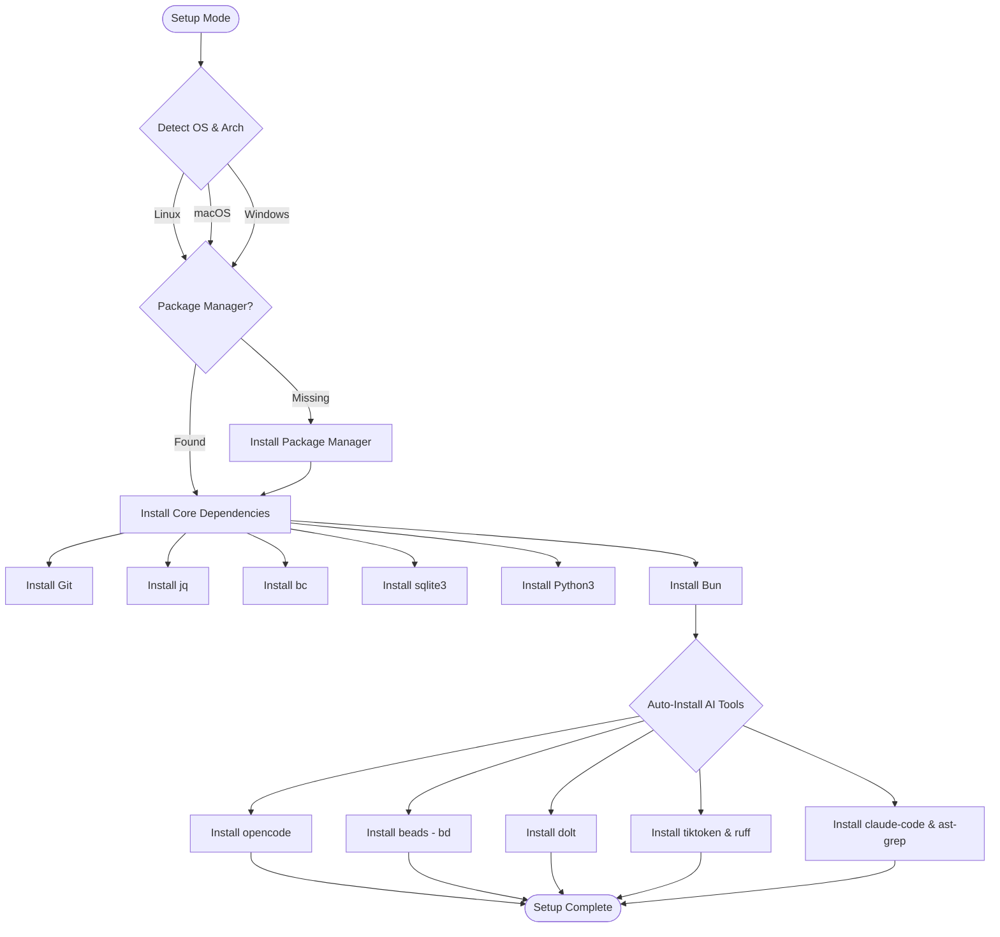

# Ralph Wiggum Agent Architecture

Ralph is a sophisticated autonomous AI agent system that uses "Grounded Architecture" principles to maintain consistency across three key artifacts (PRD, Plan, Diagram) while employing reflexion techniques to detect and break out of unproductive loops.

## System Overview


## Data Flow Sequence


## State Tracking & Reflexion


## Dependency Installation Flow



## File Management & Archiving


## Task Management with Beads


## Intelligent Model Routing


## Key Features

### 1. Grounded Architecture
Ralph maintains synchronized artifacts for consistent execution:
- **prd.json**: Product requirements in JSON format
- **ralph_plan.md**: Human-readable execution plan synced from Beads
- **ralph_architecture.md**: Mermaid diagrams of system architecture
- **agents.md**: Project-specific instructions and conventions (highly effective for agent alignment)

### 2. Time-Travel Task Management
- Uses **Beads** (`bd` CLI) for dependency-aware task tracking
- Optional **Dolt** backend provides git-like version control for tasks
- Full task history and ability to replay states
- Tasks automatically synced to human-readable plan file

### 3. Intelligent Model Routing
- Automatically routes requests to optimal models based on role:
  - **Planner/Thinker**: High-reasoning models (Gemini 2.0 Pro/Thinking)
  - **Engineer**: High-speed implementation (Gemini 2.0 Flash)
  - **Tester**: Efficient verification models
- Dynamic model discovery and caching
- Fallback chains for unavailable models

### 4. Reflexion & Loop Detection
- **Lazy Detection**: Identifies when agent isn't making progress (no file changes)
- **Loop Detection**: Catches repetitive actions via log signature analysis
- **Automatic Correction**: Injects reflexion prompts to break unproductive patterns
- **User Steering**: Interactive mode for mid-iteration guidance

### 5. Genetic Memory
- Persists engineering lessons across projects
- Stored in `~/.config/ralph/memory/global.json`
- Automatically recalls relevant patterns
- Helps avoid repeating mistakes

### 6. Self-Healing Tooling
- Auto-detects missing dependencies (pytest, npm, cargo, etc.)
- Attempts autonomous installation via `ralph setup`
- Graceful degradation when tools unavailable

### 7. War Room Coordination
- Real-time event system for multi-agent coordination
- Message passing between agents
- Task board for swarm orchestration

## Usage

### Basic Usage
```bash
# Run with default tool (opencode)
./ralph.sh

# Specify a tool
./ralph.sh --tool opencode
./ralph.sh --tool amp
./ralph.sh --tool claude

# Specify model
./ralph.sh --model "google/gemini-2.0-flash-001"

# Set max iterations
./ralph.sh --max-iterations 20

# Resume from checkpoint
./ralph.sh --resume

# Interactive mode (pause between iterations)
./ralph.sh --interactive

# Run internal tests
./ralph.sh --test

# Run in Docker sandbox
./ralph.sh --sandbox

# Add context files
./ralph.sh --context docs/api.md --context lib/utils.sh

# Include recent git diffs in context
./ralph.sh --diff-context

# Disable archiving
./ralph.sh --no-archive
```

### Copilot Integration
```bash
# Run an agentic task with Copilot
./ralph.sh copilot run "Refactor the login function"

# Ask for an explanation
./ralph.sh copilot explain "How does the event bus work?"

# Authenticate Copilot
./ralph.sh copilot auth
```

### Setup
```bash
# Auto-install all dependencies
./ralph.sh --setup

# Initialize a new project
./ralph.sh --init
```

### Task Management
```bash
# Create a task
bd create "Implement user authentication" -d "Add JWT-based auth" --deps "tk-001"

# List ready tasks (unblocked)
bd ready

# Close a task
bd close tk-123

# View task history (with Dolt)
bd vc log
```

### Swarm Commands
```bash
# Spawn a sub-agent
./ralph.sh swarm spawn --role "Frontend Developer" --task "Build UI"

# Send message to agent
./ralph.sh swarm msg --to agent-123 --content "Status update?"

# List all agents
./ralph.sh swarm list
```

## Configuration

### Environment Variables
- `TOOL`: AI tool to use (opencode, amp, claude)
- `SELECTED_MODEL`: Specific model to use
- `MAX_ITERATIONS`: Maximum iterations (default: 10)
- `LOG_FILE`: Path to log file (default: ralph.log)
- `VERBOSE`: Enable debug logging (true/false)

### Configuration File
Ralph supports `.ralphrc` or `ralph.config.json` for persistent settings:

```json
{
  "tool": "opencode",
  "max_iterations": 15,
  "interactive": false,
  "verbose": true
}
```

## Required Dependencies

### Core
- bash (4.0+)
- git
- jq
- curl
- bc
- sqlite3
- python3
- bun (preferred) or npm

### AI Tools (at least one)
- opencode (recommended)
- amp (Anthropic MCP)
- claude-cli

### Task Management
- bd (beads) - installed via `go install`
- dolt (optional) - for time-travel capabilities

### Optional
- docker (for sandbox mode)
- ruff (Python linting)
- ast-grep (code analysis)
- tiktoken (accurate token counting)

## Architecture Principles

### Cognitive Process
Every agent response follows:
1. **Reflect**: Analyze recent changes and context
2. **Plan**: Identify next unblocked task from Beads
3. **Reason**: Determine efficient tool-path
4. **Anticipate**: Identify potential side effects

### Verification Mandatory
- All code changes require tests
- Tasks not closed until tests pass
- Runtime verification for services
- Architectural integrity checks

### Constraints
- **Diagram First**: Update architecture before complex features
- **Valid Artifacts**: Ensure JSON and Mermaid validity
- **No Loops**: Detect and break unproductive cycles
- **Termination**: Only signal completion when all tasks closed

## Project Structure

```
.
├── ralph.sh                  # Main entry point
├── lib/
│   ├── utils.sh             # Utility functions
│   ├── engine.sh            # Core iteration engine
│   └── tools.sh             # Tool integrations
├── prd.json                 # Product requirements
├── agents.md                # Project-specific instructions
├── ralph_plan.md            # Execution plan (synced from Beads)
├── ralph_architecture.md    # System diagrams
├── progress.txt             # Run metadata
├── ralph.log                # Execution log
├── .ralph_checkpoint        # Resume state
├── .last-branch             # Branch tracking
├── .beads/                  # Task database
│   └── tasks.db             # SQLite or Dolt
└── archives/                # Previous runs
    └── 2026-01-28_10-30-00-feature/
```

## Advanced Features

### Context Windowing
Ralph intelligently manages context window size:
- Prioritizes recent and relevant information
- Compresses older context
- Maintains critical artifacts in full

### Token Estimation
Multiple estimation methods:
- Simple (chars/4)
- Advanced (heuristic with code detection)
- tiktoken (accurate, requires Python library)

### Runtime Verification
Automatically identifies and verifies:
- Rust projects (`cargo check`)
- Node.js projects (package.json validation)
- Python projects (`ruff check`)
- Go projects (`go vet`)
- Running services (health checks, benchmarks)

### Performance Monitoring
- Tracks iteration metrics
- Monitors lazy streaks
- Logs token usage
- Detects performance regressions

## Troubleshooting

### Agent Making No Progress
- Check `ralph.log` for errors
- Review lazy streak counter
- Enable `--interactive` mode for steering
- Try different role or model

### Tasks Not Closing
- Verify tests are passing
- Check `bd ready` for blockers
- Review task dependencies

### Model Not Available
- Check `opencode models` for available options
- Specify model explicitly with `--model`
- Fallback chain will try alternatives

### Memory Issues
- Reduce `MAX_ITERATIONS`
- Enable archiving to clear old runs
- Check for large excluded directories

## Contributing

Ralph is designed to be extensible:
- Add new AI tools in `lib/tools.sh`
- Extend validation in `lib/engine.sh`
- Add new roles in `get_role_instructions()`
- Implement new features as skills

## License

See LICENSE file for details.