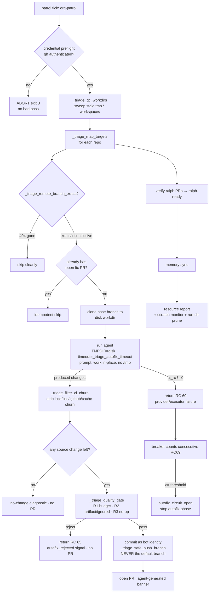
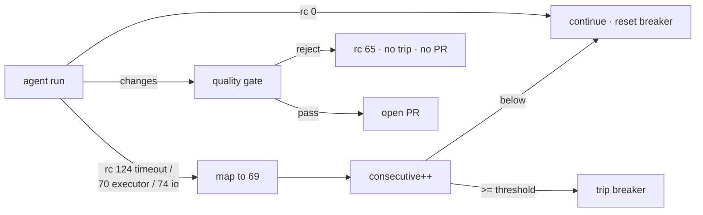

# Ralph Autofix Resilience — Design & How It Works

> How Ralph's autonomous cross-repo autofix loop survives a hostile environment,
> refuses to ship bad work, and never impersonates anyone — and the reasoning
> behind each mechanism.
>
> Scope: the failure modes discovered while soaking the `resq-software` patrol
> (Aug 2026) and the layered defenses added in response (PRs #65, #69–#73, plus
> the operational hardening). Companion to [`DESIGN.md`](DESIGN.md); per-feature
> specs live under [`docs/superpowers/specs/`](superpowers/specs/).

---

## 1. What the autofix loop is

Ralph runs a scheduled **patrol** (`scripts/org-patrol`, a systemd user timer,
30-min cadence) over an allowlist of repos. For each repo it observes actionable
work (failing CI, open code-scanning alerts, unresolved review comments) and, in
an *apply* mode, spawns an AI agent to produce a fix, then opens a PR.

The **trust boundary is fixed: autonomous up to the merge.** Ralph observes →
fixes → verifies → labels `ralph-ready` → opens the PR, and **stops.** A human
merges. Every mechanism below is designed to hold that line: never push the
default branch, never merge, never edit its own control surface, and never open
a PR it cannot stand behind.

The per-repo engine is `_triage_apply_fix` (`lib/triage.sh`); the loop that
drives it across repos is `_triage_map_targets`; the agent is launched through
`run_ai_tool` / `_apply_tool_env` (`lib/engine.sh`).

---

## 2. The incident that started it — the "sterile green loop"

On 2026-08-04 the patrol was **healthy on every dashboard** (`band=normal
ok=true`) yet had produced **zero fixes**: **177 / 177 autofix attempts died
with `provider_failure: tool exited 74`**, with `tool.log` and `tool.out` both
**0 bytes** — the provider dying before emitting a single byte.

**Root cause.** `opencode` (a bash wrapper → node) writes every session's
scratch under `$TMPDIR/opencode` = `/tmp/opencode`, and `/tmp` on this host is a
**16 GB RAM tmpfs**. Sessions are never reaped, so `/tmp/opencode` had grown to
~12 GB / 443k files, keeping `/tmp` chronically ~81 % full. A 10-repo patrol
burst tips it over → opencode's writes hit `ENOSPC`/`EDQUOT` → it exits with
**zero output** → Ralph records `exit 74` (`EX_IOERR`). opencode worked fine
interactively; the failure was intermittent and only under `/tmp` pressure.

**Two things let it hide:**
1. The resource monitor watched the `.ralph` runs dir (`disk=24.6M`), **not the
   scratch filesystem that was actually full.**
2. The autofix loop had **no circuit-breaker** — it retried each repo, swallowed
   the outcome, and moved on, so an *environmental* fault common to every repo
   produced 177 identical silent failures instead of one loud signal.

This one incident defines the whole design: **an autonomous loop must make the
*class* of a failure observable and self-limiting, and must never mistake
"green" for "working."**

---

## 3. Design principles

| Principle | Applied as |
|-----------|-----------|
| **Scratch never lives on volatile RAM.** | opencode `TMPDIR`→disk (#69); patrol `TMPDIR`→disk; agent told to work in-place (#73). |
| **Fail-open for observability, fail-closed for safety.** | The scratch monitor degrades to `null` on a measurement gap (never blocks a run); the quality gate rejects an *unmeasurable* diff (never ships it). |
| **Every knob is opt-in and default-safe.** | Retention/timeout/workflow-autofix all default to off / no-change; turning them on can only help. |
| **A failure's *class* must survive to the caller.** | Classified return codes (§6) so the loop can tell "environment" from "bad diff" from "transient." |
| **Verification gates before promotion.** | A PR only gets `ralph-ready` after its CI is confirmed green; the quality gate runs *before* the push. |
| **Evidence over assertion.** | Every autofix writes an evidence dir (`outcome.json`, `summary.json`, tool logs); "band=normal" is derived from measured warnings, not assumed. |
| **Never impersonate.** | The bot commit identity can never default to a real account (§5.8). |
| **The harness never edits its own control surface.** | Ralph's own `.github/` is stripped even in workflow-autofix mode. |

---

## 4. The autofix lifecycle (and where each guard sits)

The autofix *phase* can be short-circuited by the breaker, but **verify,
memory, and the resource report always run** — so a bad autofix run still
records evidence and a healthy summary.

---

## 5. The mechanisms

### 5.1 Scratch isolation — three layers (PR #69, #73, patrol env)
The RAM-tmpfs hazard is attacked at every level scratch is created:
- **opencode's own scratch** — `_apply_tool_env opencode` (`lib/engine.sh`)
  exports `TMPDIR="${RALPH_TMPDIR:-${XDG_CACHE_HOME:-$HOME/.cache}/ralph/tmp}"`,
  subshell-scoped, fail-open. (#69 — cut `/tmp/opencode` from 12 GB → 591 MB.)
- **tool/`mktemp` scratch** — `TMPDIR=<disk>` in the patrol env moves every
  TMPDIR-respecting child (node, npx, dotnet, git, mktemp) *and the scratch
  monitor* onto disk.
- **agent-hardcoded scratch** — the CI-autofix prompt instructs the agent to do
  all work in the current directory and **never create `/tmp/<name>` dirs** (#73).
  This closes the residual `exit 74` that #69 couldn't: literal `/tmp/osvfix`,
  `/tmp/pr248` etc. that `TMPDIR` cannot redirect.

### 5.2 Scratch-filesystem monitor (PR #70, `lib/resources.sh`)
`_resource_scratch_json` adds a `.system.scratch` block to the resource report —
`df` of `$TMPDIR` for both **byte** and **inode** usage. Budget
`RALPH_RESOURCE_MAX_SCRATCH_PCT` (default 90); exceeding it on either axis emits
a `scratch` warning, which flips the band off `normal` (band = "normal iff zero
warnings"). This is the sensor that would have caught the original incident on
run 1. Fail-open: unmeasurable → `null`, no warning.

### 5.3 Circuit-breaker (PR #70, `lib/triage.sh`)
`_triage_apply_fix` returns `RALPH_TRIAGE_RC_PROVIDER_FAILURE` (69) on **any**
agent failure that produced no usable result — provider *or* executor, since both
are environmental. The sequential `_triage_map_targets` loop counts **consecutive**
69s; at `RALPH_AUTOFIX_BREAKER_THRESHOLD` (default 3) it **trips**: stops
attempting further autofix targets this run, records an `autofix_circuit_open`
signal, and logs a loud remediation hint. Any non-69 result resets the counter,
so three-in-a-row across *different* repos — the signature of an environmental
fault, not a per-repo bug — is what trips it. Exit stays 0 so the timer keeps
ticking.

### 5.4 Quality gate (PR #70/#71, `_triage_quality_gate`)
Runs **after** the source-only filter and **before** the push — an assertion on
the final staged diff. Rejects (→ `RALPH_TRIAGE_RC_QUALITY_REJECT` 65 +
`autofix_rejected` signal, no PR) when:
- **R1 — scope budget:** non-lockfile changes exceed `RALPH_AUTOFIX_MAX_FILES`
  (25) or `RALPH_AUTOFIX_MAX_LINES` (800). Lockfiles are exempt
  (`RALPH_AUTOFIX_LOCKFILE_NAMES`) — a 3000-line `uv.lock` is legitimate.
- **R2 — build-artifact / ignored paths:** any path matched by the repo's
  `.gitignore` (`git check-ignore`) or under `bin/ obj/ node_modules/ dist/
  build/ target/ .venv/ __pycache__/ .next/ coverage/`, or with a
  `.dll/.exe/.pdb/.class/.o` extension.
- **R3 — no-op / empty:** the effective diff is empty or only creates empty files.

65 is deliberately distinct from 69 so a *bad-but-non-environmental* fix does
**not** trip the breaker. Calibrated against real PRs: `dotnet-sdk #84` (910
`bin/obj` files) fails R1+R2; `docs #116` (empty `.lycheecache`) fails R3;
`viz #143` (+1/−1 lockfile) and `pypi #79` (3094-line `uv.lock`) pass.

### 5.5 Source-only churn filter + workflow-autofix mode (PR #71)
`_triage_filter_ci_churn` reverts the dep/lockfile/CI churn an agent picks up
along the way (per-path — see §7), so a PR opens only on a real change. It also
discards **generated cache files** (`RALPH_TRIAGE_CACHE_FILES`, default
`.lycheecache`) at any depth — killing the "reordered-cache no-op PR" class.
`.github/` is churn by default; **workflow-autofix mode**
(`RALPH_TRIAGE_ALLOW_WORKFLOW` / `--allow-workflow-fix`, default **off**) spares
only `.github/workflows/` so a genuinely workflow-only fix can land. Both the
prompt clause and the filter derive from **one gate**
(`_triage_workflow_fix_enabled`) so the agent is never told to do what the filter
would then throw away. Ralph's own `.github/` is always stripped
(`_triage_strip_self_control_surface`).

### 5.6 Stale-branch skip (PR #71)
`_triage_remote_branch_exists` returns 0 (exists) / 1 (confirmed 404 → skip
cleanly) / 75 (inconclusive → proceed, let the clone decide). Dependabot deletes
a branch the moment its PR lands, so a queued finding can name a vanished branch;
this turns a scary red ERROR + wasted clone into a clean skip.

### 5.7 Workspace GC + run-dir retention (PR #71, #72)
- `_triage_gc_workdirs` at triage startup sweeps `tmp.*` autofix workspaces older
  than `RALPH_TRIAGE_WORKDIR_TTL_HOURS` (6) — the RETURN-trap cleanup can't run
  when a patrol is SIGKILLed. The TTL keeps a concurrent patrol safe.
- `_resource_prune_run_dirs` (`resource report --prune-runs N` /
  `RALPH_RESOURCE_RUN_RETENTION`, default 0=off) keeps the newest N `.ralph/runs`
  dirs (timestamp-named → name sort = chronological) and deletes older, recording
  `.disk.run_dirs_pruned`. Observed effect: 1198 dirs / 130 MB → 202 / 64 MB.

### 5.8 Bot identity (PR #71)
Automated commits previously hardcoded `ralph-bot@users.noreply.github.com` — the
canonical noreply of the **real third-party account** `github.com/ralph-bot`, so
every fix impersonated that user. `_triage_bot_identity` makes the identity
configurable (`RALPH_BOT_NAME` / `RALPH_BOT_EMAIL` → point at a bot account you
control), defaulting to `ralph-autofix` + an email on the RFC-2606 reserved
`.invalid` TLD so it **can never map to any real GitHub account**.

### 5.9 Heavy-repo timeout knob (PR #72)
`_triage_autofix_timeout` lets `RALPH_TRIAGE_TIMEOUT` raise the agent's total
tool timeout **for the patrol only** (falls back to `RALPH_TOOL_TIMEOUT`, then
1800s) — so slow-building repos (.NET, big CI) get more time without changing the
main loop. (Note: genuinely oversized fixes still time out — the knob buys time,
not miracles.)

### 5.10 Credential preflight + keyring-independent auth (operational)
The patrol runs a `gh auth` preflight and **aborts (exit 3) rather than running a
broken pass**. On a locked-keyring host (the token unlocks only at interactive
login), a headless tick would abort forever and the `OnUnitActiveSec` timer would
stop re-arming. Fix: `GH_TOKEN` in the patrol env file (0600) — `gh` honors it
over the keyring, so the patrol authenticates through suspend/resume and
pre-login boots. Proven with `GH_CONFIG_DIR=/nonexistent` (auth on `GH_TOKEN`
alone).

---

## 6. Return-code taxonomy

The whole loop's behavior turns on a small, deliberate set of exit codes flowing
out of `_triage_apply_fix`:

| Code | Name | Meaning | Breaker? | PR? |
|------|------|---------|----------|-----|
| `0` | ok / skip | fix opened, no-change, or idempotent skip | resets | maybe |
| `1` | error | hard/setup error (bad args, unreadable logs) | resets | no |
| `65` | `RALPH_TRIAGE_RC_QUALITY_REJECT` (`EX_DATAERR`) | diff rejected by the quality gate | **no** | no |
| `69` | `RALPH_TRIAGE_RC_PROVIDER_FAILURE` (`EX_UNAVAILABLE`) | agent produced nothing usable (provider/executor/timeout) | **yes** | no |
| `75` | transient / deferred | GitHub outage, clone race — try again next tick | resets | no |

The key invariant: **only environmental failure (69) trips the breaker.** A
bad-but-green fix (65) is a per-repo problem, not a systemic one, so it must not
short-circuit the whole run.

---

## 7. Design lessons (the reasoning worth keeping)

- **"Green" is a claim, not a fact.** The original loop reported `band=normal`
  while 100 % sterile. Health must be *derived from what's measured*, and the
  monitor must watch the resource that actually fails (the scratch fs), not a
  convenient proxy (the runs dir).
- **Shape ≠ correctness.** The quality gate judges the *shape* of a diff
  (artifact? bloated? empty?); the verify loop judges *correctness* (does CI go
  green?). Both are needed and they are separate stages — a surgical-looking fix
  (`dotnet-sdk #87`, a flaky-test poll loop) can still fail CI for an unrelated
  reason (an expired `buf.build` token), and a green diff can still be garbage.
- **Cross-tool fallback wouldn't have saved the original bug.** All providers
  write scratch to the same `/tmp`; degrading opencode→claude would have hit the
  identical `ENOSPC`. The right layer for an environmental fault is a breaker +
  a monitor, not a model swap.
- **`git checkout -- a b c` is all-or-nothing.** A latent bug (#71): the churn
  filter reverted five lockfiles in one pathspec, so any repo missing one aborted
  the whole revert and leaked churn. Fixed per-path. Grep for other
  multi-pathspec `git checkout --`.
- **Autonomy amplifies small mistakes.** A hardcoded bot email became mass
  impersonation across an org; a missing `.gitignore` in one repo became repeated
  910-file artifact PRs. Defaults that touch the outside world must be safe by
  construction.
- **The trust boundary earns its keep.** Hand-review of the `ralph-ready` queue
  found roughly as many bad fixes as good ones; "human merges" is not ceremony.

---

## 8. Configuration reference

**Scratch / disk**
- `RALPH_TMPDIR` — opencode scratch base (default `${XDG_CACHE_HOME:-$HOME/.cache}/ralph/tmp`).
- `TMPDIR` (patrol env) — moves all tool scratch + the scratch monitor to disk.
- `RALPH_RESOURCE_MAX_SCRATCH_PCT` — scratch-fs warning budget (90).
- `RALPH_RESOURCE_RUN_RETENTION` — keep newest N `.ralph/runs` (0 = off).
- `RALPH_TRIAGE_WORKDIR_TTL_HOURS` — GC stale autofix workspaces (6).

**Autofix safety**
- `RALPH_AUTOFIX_BREAKER_THRESHOLD` — consecutive provider failures before trip (3).
- `RALPH_AUTOFIX_MAX_FILES` / `RALPH_AUTOFIX_MAX_LINES` — quality-gate budget (25 / 800).
- `RALPH_AUTOFIX_LOCKFILE_NAMES` — budget-exempt lockfiles.
- `RALPH_TRIAGE_CACHE_FILES` — generated caches discarded as churn (`.lycheecache`).
- `RALPH_TRIAGE_ALLOW_WORKFLOW` — enable workflow-autofix mode (off).
- `RALPH_TRIAGE_TIMEOUT` — patrol-only agent timeout override (→ `RALPH_TOOL_TIMEOUT` → 1800s).

**Identity / auth**
- `RALPH_BOT_NAME` / `RALPH_BOT_EMAIL` — commit identity (default `ralph-autofix` @ `.invalid`).
- `GH_TOKEN` (patrol env, 0600) — keyring-independent GitHub auth.

---

## 9. Change history

| PR | What |
|----|------|
| #65 | Autofix clones to a disk-backed workdir (first tmpfs-hazard fix). |
| #69 | opencode `TMPDIR` → disk — root-cause fix for the `exit 74` storm. |
| #70 | Resilience triad: scratch monitor · circuit-breaker · quality gate. |
| #71 | Patrol hygiene: workflow autofix · stale-branch skip · workspace GC · cache-churn filter · bot-identity fix (+ per-path `git checkout` bug). |
| #72 | Run-dir retention · heavy-repo timeout knob. |
| #73 | Agent works in-place, never `/tmp` — residual `exit 74` fix. |
| resq-software/dotnet-sdk #90 | Add a `.NET` `.gitignore` — stops artifact dumps at the source. |

_Last updated: 2026-08-15._
