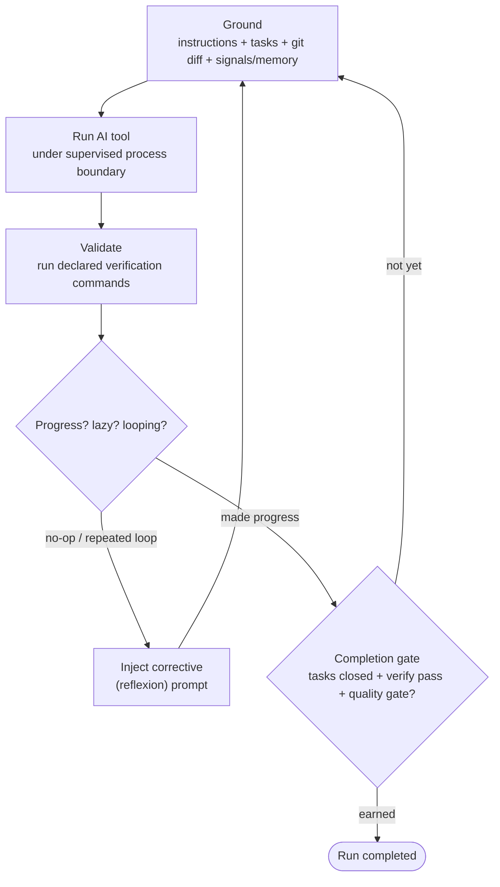
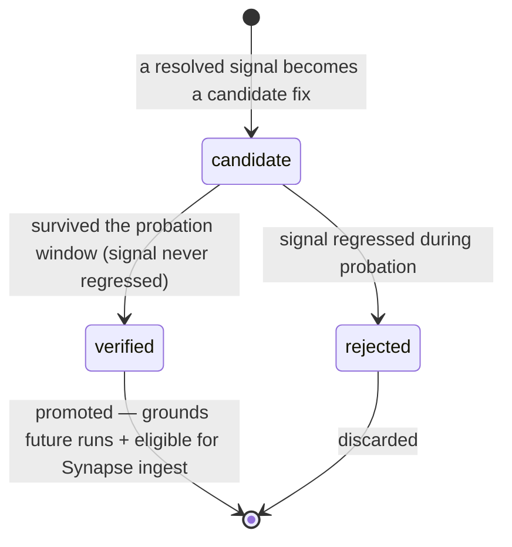
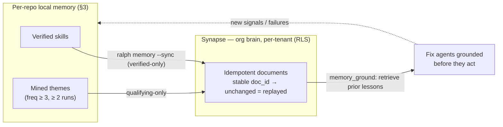
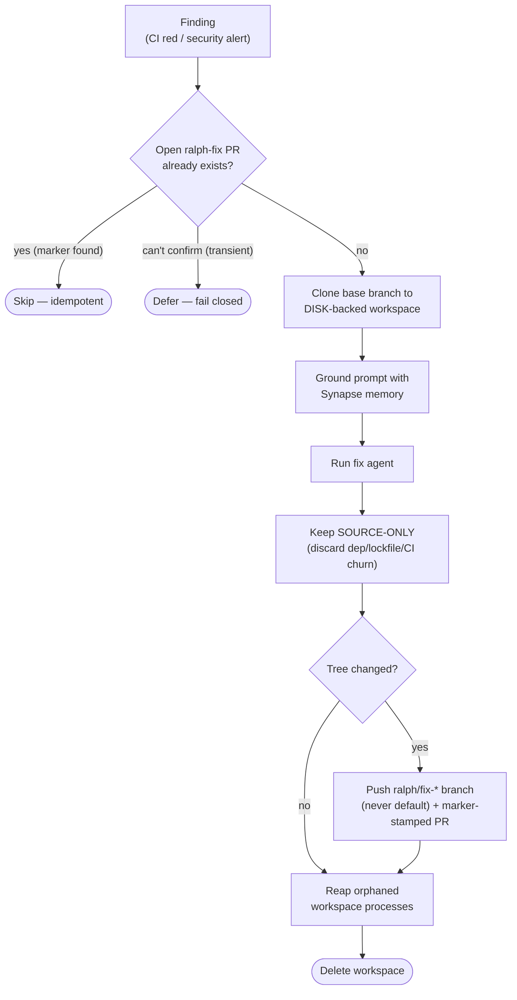
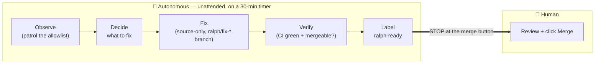

# Ralph — Design & Reasoning

> This is the **why**, not the **what**. The [README](../README.md) covers what Ralph
> does and how to run it. This document records the design decisions, the reasoning
> behind them, the principles that recur across the codebase, and the lessons learned
> the hard way. If you are changing Ralph's behavior, read this first — most of the
> non-obvious code exists to uphold a principle stated here.

---

## 0. The core thesis

Ralph is a **long-running autonomous agent loop**. The unit of work is not "answer a
prompt" but "keep working from a persistent plan until the work is genuinely done."
Everything else follows from taking that sentence seriously.

Three things make that safe and useful rather than a runaway token furnace:

1. **Ralph does not trust the agent's self-report.** Completion is *earned* against
   gates, not *announced*. Progress is measured, not claimed.
2. **Ralph learns across runs.** Recurring failures become signals; proven fixes become
   verified skills; failure themes are mined across the whole run ledger. Memory
   *compounds* — and, via Synapse, compounds *across repositories*.
3. **Ralph acts across many repositories autonomously — but stops at a deliberate trust
   boundary.** It observes, decides, fixes, verifies, and opens PRs unattended; then it
   **stops at the merge button**. A human merges.

The name ("a surprisingly functional Ralph Wiggum loop") is deliberately unpretentious.
The sophistication is not in the agent — it's in the guardrails around it.

---

## 1. Design principles (the throughlines)

These principles recur in nearly every subsystem. When a piece of code looks more
defensive than seems necessary, it is almost always upholding one of these.

### 1.1 Don't trust self-reports
An agent claiming "done" is evidence of nothing. Ralph gates completion on closed tasks
+ passing verification commands + an explicit quality gate. A skill claiming "this fix
works" is not promoted until it has survived a probation window without regressing. A
finding claiming to be a real bug is verified adversarially before it is acted on. The
final whole-branch code review runs at a *different altitude* than the per-task reviews,
because it catches classes of error the narrow reviews cannot see.

### 1.2 Fail-open for optional systems; fail-closed for safety-critical checks
- **Fail-open** (never block the loop): Synapse, compounding-memory retrieval, live
  smoke checks. If Synapse is down, `ralph memory` is inert and the loop proceeds. An
  optional enhancement must never be able to stop autonomy.
- **Fail-closed** (refuse the risky action): idempotency dedup checks. If Ralph cannot
  *confirm* whether an open fix PR already exists (transient GitHub error, `rc 75`), it
  **defers** rather than risk opening a duplicate. When the safe default is "do nothing,"
  uncertainty resolves to "do nothing."

The direction of failure is a deliberate, per-decision choice, not an accident.

### 1.3 Idempotency (timer-safe by construction)
Ralph runs unattended on a 30-minute timer. Every externally-visible action must be
safe to repeat. Fix PRs carry a stable marker (`<!-- ralph-fix:<kind>:<key> -->`) and
Ralph refuses to open a second PR for the same finding. Synapse documents use a stable
`doc_id` derived from the knowledge key, so re-syncing unchanged knowledge is a no-op
`replayed`. Nothing Ralph does should produce N copies when the timer fires N times.

### 1.4 Verification gates before promotion
Nothing graduates on its own say-so. A candidate skill must survive a probation window
(`RALPH_SKILL_REQUIRE_VERIFY`) before it can be approved. A fix PR is labeled
`ralph-ready` only when CI is **green** and the PR is **mergeable** — and the label is
removed again if it goes red. Promotion is a state transition guarded by evidence.

### 1.5 Human-in-the-loop at irreversible / outward-facing steps
The merge button is irreversible-ish and consequential, so a human owns it. Security
fixes are the owner's call. "Autonomous" for Ralph means *autonomous within an explicit
boundary a human configures once* — not autonomy that discards the guardrails.

### 1.6 Isolation & least privilege
Autonomous code changes are **source-only** (dependency/lockfile/CI churn is discarded),
land on **`ralph/fix-*` branches only** (never a default/base branch), are scoped to an
explicit **allowlist**, and run in **throwaway, disk-backed workspaces**. Self-triage can
never rewrite Ralph's own control surface (`lib/`, `ralph.sh`, `scripts/`, config). The
blast radius of a bad autonomous action is bounded by construction, not by good behavior.

### 1.7 Bounded resources
Long-running processes must not grow without bound. The failure-mining ledger read is
bounded (`RALPH_MINE_MAX_LINES`). Clone workspaces live on disk, not a size-capped RAM
tmpfs. Orphaned child processes are reaped before their workspace is deleted. Unbounded
growth is treated as a bug, because on a timer it *always* eventually bites.

### 1.8 Evidence over assertion
Every feature ships test-first (TDD). Verification writes durable artifacts
(`verification.json`, per-iteration provider summaries). Claims of success are backed by
command output, not adjectives. This document's companion discipline is: never say
"done" without a green run to point at.

---

## 2. The iteration engine (`lib/engine.sh`)

The loop is: **ground → run the tool under a supervised boundary → validate → analyze →
persist or correct → repeat**, until a completion gate opens or a limit is hit.

### 2.1 Grounding
Each iteration re-grounds the agent in the instructions file (`AGENTS.md`/`CLAUDE.md`),
the ready Beads tasks, `git diff`, run artifacts, and prior signals/memory. **Reasoning:**
a single up-front prompt goes stale as the working tree changes; re-grounding every
iteration keeps the agent anchored to *current* reality rather than its own drifting
narrative.

### 2.2 The supervised process boundary
Ralph does not just `exec` the AI tool. It launches the provider under a Python
supervisor in its **own session/process group**, owning stdout/stderr capture, identity
validation, and a child guardian. **Reasoning:** clean provider attribution (no pipeline
process can masquerade as the provider), and — critically — a well-defined process tree
Ralph can *terminate as a group* on timeout. (The limits of that group-kill are the
subject of a hard lesson in §8.)

### 2.3 Two timeouts: wall-clock and quiescence
- **Wall-clock** (`RALPH_TOOL_TIMEOUT`, default 1800s): a hard backstop, because no tool
  has a reliable built-in timeout and a naive wait-on-PID waits forever.
- **Idle quiescence** (`RALPH_TOOL_IDLE_TIMEOUT`): after the agent has made project
  progress *and* discovered its verification step, if it then goes quiet, Ralph stops it
  and moves to verification. **Reasoning:** an agent that has done the work but is now
  spinning should be moved forward, not waited on. The watchdog only *arms* after real
  progress, so it never cuts off an agent that is still thinking.

### 2.4 Progress, lazy, and loop detection → reflexion
Ralph fingerprints project state between iterations. A no-op iteration or a repeated loop
signature triggers a **corrective ("reflexion") prompt** rather than silently burning an
iteration. **Reasoning:** the cheapest failure mode of an agent loop is confidently doing
nothing; detecting it and intervening is what separates a loop from a spend meter.

### 2.5 Completion is earned, not announced
A `<promise>COMPLETE</promise>` is honored **only** when every Beads task is closed, the
declared verification commands pass, and the quality gate reads `pass`. Otherwise the
loop injects a "completion blocked" prompt and continues. **Reasoning:** see §1.1. The
single most important line of defense against "the agent said it's done" is to not
believe it.

### 2.6 Cross-tick session continuity
Ralph persists a small session marker (`{tool, established_at, run_id}`, TTL-bounded) so
a provider session can be reused across ticks instead of cold-starting each time.
**Reasoning:** continuity where it's cheap and safe, re-establishment where it's stale.

---

## 3. Compounding memory (per-project)

Ralph has **two** distinct memory systems. Keeping them distinct is itself a design
decision.

### 3.1 The signal → skill → lint → mine pipeline
- **Signals** (`lib/signals.sh`): recurring problems, deduplicated by a `theme_key`, with
  a lifecycle (`open → ack → resolved`). One durable record per theme, not one per
  occurrence.
- **Skills** (`lib/skills.sh`): a signal that stayed resolved becomes a *candidate* fix.
  A candidate is **not** trusted immediately — it carries `verified: false` and a
  probation timestamp, and is only promoted to `verified` after surviving a probation
  window without the underlying signal regressing (`verify_skills`). **Reasoning (§1.4):**
  a fix that "worked once" may have been luck; the probation gate is what stops Ralph from
  certifying its own noise into durable guidance.
- **Lint** (`lib/lint.sh`): separates the candidate backlog into `backlog` (verified) and
  `probation` (unverified), so the two are never conflated.
- **Mine** (`lib/mine.sh`): a meta-loop over the whole run ledger that aggregates *failure
  themes* across runs (stalls, verify failures, no-progress, token blowups), ranks them,
  flags regressions, and can feed deduped signals or propose a fix. The ledger read is
  **bounded** (`RALPH_MINE_MAX_LINES`) because the ledger grows unbounded across runs
  (§1.7).

A candidate skill is not trusted until it has *earned* it — the verification gate as a
state machine:

The pipeline is a ratchet: problems compound into signals, signals into verified skills,
skills into guidance the next run is grounded in.

### 3.2 Genetic memory (the older, separate system)
Independently, `lib/engine.sh` captures `<memory>…</memory>` blocks from agent output
into a global lessons store surfaced by `recall_lessons`. This is *per-agent*,
lightweight, and predates the signal/skill pipeline. **Reasoning for keeping both:** they
operate at different granularities (a one-line lesson vs a verified, probation-gated
skill) and there is no code collision. A naming collision *did* exist at the test level
(`tests/test_memory.sh` was the genetic-memory suite) and caused a real incident (§8) —
which is exactly why this section exists: **there are two memory systems; do not conflate
them.**

---

## 4. The Synapse bridge (cross-repo org brain)

Everything in §3 is *per-repository local JSON*. A lesson learned patrolling one repo
could never inform another. The Synapse bridge (`lib/memory.sh`, `ralph memory`) closes
that loop.

*Fail-open:* every arrow above is best-effort — if Synapse is unset or down, the bridge
is inert and the loop proceeds unchanged.

- **Ingest:** `ralph memory --sync` pushes **verified** skills and **qualifying** mined
  themes into Synapse (an org-brain retrieval service) as **idempotent documents** (stable
  `doc_id` → unchanged = `replayed`, no re-embed).
- **Retrieve:** fix agents are grounded with prior lessons before they act, injected once
  at the shared `_triage_apply_fix` chokepoint.

Four locked decisions and their reasoning:
- **Closed loop** (ingest *and* retrieve) — memory that only accumulates is a write-only
  log; the value is in reading it back before acting.
- **Per-tenant** — knowledge lives in `SYNAPSE_TENANT` and respects Synapse's row-level
  security. It compounds across a tenant's repos, but org knowledge and personal-repo
  knowledge never mix.
- **Verified-only** — ingest only trust-gated knowledge (§1.4), so retrieval stays clean.
  Feeding raw signals or every triage finding would pollute recall.
- **Fail-open** (§1.2) — Synapse is an *enhancement*. Unset, unreachable, or erroring, the
  whole feature is inert and never blocks a run. A failed ingest records a deduped
  `memory_sync_failed` signal (which compounds back into §3).

The patrol runs `memory --sync` **only in apply modes** — read-only/dry modes must stay
side-effect-free, and `--sync` writes to Synapse. (This gating was a deliberate deviation
from an early plan that said "sync every tick"; see §8 on why "always" was wrong.)

---

## 5. Cross-repo triage & the autonomy engine (`lib/triage.sh`, `scripts/org-patrol`)

Triage is how Ralph acts *outside* the current project — across an allowlisted set of
GitHub repositories.

### 5.1 The modes
`--suggest` (dry issue suggestions), `--fix-ci`, `--fix-security`, `--resolve-reviews`,
`--tidy`, and `--verify-fixes`. Each `--apply` mode routes code changes through one shared
engine.

### 5.2 The shared apply engine: `_triage_apply_fix`
Every autofix mode funnels through `_triage_apply_fix`, which is where the isolation
invariants (§1.6) are enforced *once* for all of them:
- Clone the base branch to a **throwaway, disk-backed workspace** (`_triage_mktemp_workdir`).
- Run the agent with the fix prompt (grounded with Synapse context via
  `_triage_ground_prompt` — the single retrieval chokepoint, §4).
- Keep the change **source-only** (discard dependency/lockfile/CI churn).
- Only if the tree actually changed, push a **`ralph/fix-*` branch** (never the default
  branch) and open a marker-stamped PR.
- On cleanup, **reap any process rooted in the workspace** before deleting it
  (`_triage_reap_workspace_procs`), then remove the workspace.

Concentrating all of this in one function is deliberate: safety invariants enforced in one
place cannot be forgotten by one caller.

### 5.3 Idempotency & the marker
Every fix PR body carries `<!-- ralph-fix:<kind>:<key> -->`. Before cloning, Ralph checks
for an existing open PR with that marker and **skips** if found — and **fails closed**
(defers) if it cannot confirm due to a transient error (§1.2, §1.3). This is what makes
autofix safe to run every 30 minutes without spamming PRs.

### 5.4 The patrol and the ready queue
`scripts/org-patrol` (wrapped by a systemd user timer) runs the triage pass across the
allowlist, then — in apply modes — runs `--verify-fixes`, which reads each fix PR's
`statusCheckRollup`: green + mergeable → label **`ralph-ready`**; red → remove the label,
comment once, and `record_signal autofix_failed` (feeding §3). `ralph-ready` is the
operator's merge queue: `gh pr list --label ralph-ready`.

---

## 6. The trust boundary: "autonomous up to the merge"

This is the single most important decision in the project, so it gets its own section.

The question was **not** "should Ralph be autonomous: yes/no." It was **where the trust
boundary sits.** The answer:

> **Ralph is autonomous up to the merge button, and no further.**

Ralph observes → decides what to fix → fixes → verifies → opens a PR unattended, on an
explicit allowlist. Then it **stops** — at the merge, and at anything security-sensitive
or outward-facing. A human merges.

**Reasoning:** the merge is where an autonomous mistake becomes durable and hard to
reverse. Keeping a human on exactly that button preserves the entire safety posture while
still capturing almost all of the value (the tedious observe-fix-verify work is done for
you; you review a green, verified PR and click merge).

### 6.1 The five safety invariants (all test-asserted)
1. **Never merges.** There is zero `gh pr merge` in the triage/patrol paths. (The manual
   `scripts/pr-merge` helper is an operator tool, not autonomous.)
2. **CI-only autonomous.** Security fixes stay human-triggered.
3. **Allowlist-scoped, `ralph/fix-*` branches, never the default branch, source-only.**
4. **Only Ralph's own PRs.** Verify re-confirms the literal marker in the PR body before
   any write, so a human PR merely *mentioning* `ralph-fix` is never touched.
5. **Idempotent everywhere.**

### 6.2 Explicitly out of scope
Self-merge of verified `ralph/fix-*` PRs, and goal-setting / self-triggering, are
deliberately **not** in this boundary. They would each be a *fresh* trust decision — not
something to slide into. The audit that shaped this direction flagged the
decision/goal-setting layer as the weakest and least-safe to automate.

---

## 7. Operational model

- **systemd user timer** drives the patrol (default every 30 min, `Persistent=true` so a
  missed tick catches up on boot).
- **Modes** are configured once in an env file (`RALPH_ORG_TRIAGE_MODE`,
  `RALPH_ORG_CODE_WRITE_TARGETS`). The recommended autonomous mode is `fix-ci-apply`
  (CI only).
- **Soak summary** (`soak-summary.jsonl`) and **resource history** record each tick's
  outcome and a resource band (`normal`/…), so drift and regressions are visible over time.
- **Preflight** checks credentials before an apply tick, so a `gh` auth gap degrades
  gracefully instead of failing mid-run.

---

## 8. Lessons the hard way

These are real incidents. They are documented because each one encodes a principle that
is cheaper to read than to rediscover.

- **A grandchild process escaped the group-kill.** A fix agent ran `timeout 60 npx tsc`;
  `timeout` signalled `npx` but `npx` did not forward it to the `tsc` grandchild, which
  reparented to `init` *outside* Ralph's process group — so the group-kill missed it. Then
  Ralph deleted the workspace out from under it, and the orphaned type-check on a large
  monorepo ballooned to ~25 GB RAM. **Fix:** reap any process whose CWD is inside the
  workspace *before* deleting it (`_triage_reap_workspace_procs`), regardless of process
  group. **Principle:** you cannot rely on process-group membership to catch grandchildren
  a tool detached; reap by the resource (the workspace) instead.

- **Clones into a RAM tmpfs failed with ENOSPC.** Ralph cloned repos via `mktemp -d`,
  which resolves to `/tmp` — a 16 GB RAM-backed tmpfs. Unrelated tooling filled it, so git
  checkouts (and the agent) failed writing files, while an 800 GB disk sat idle. **Fix:**
  clone to a disk-backed workdir by default (`_triage_mktemp_workdir`,
  `RALPH_TRIAGE_WORKDIR`). **Principle:** disk-heavy, RAM-precious work (clone +
  `npm install` + build) does not belong in a size-capped RAM disk.

- **A `union` merge silently dropped a closing brace.** Resolving a branch conflict with
  git's `union` merge driver (line-wise union) dropped the `}` closing a function — an
  unbalanced brace that cascaded to EOF and undefined *every* function below it. The suite
  went from green to 115 failures, and it was briefly *misdiagnosed as environmental*
  because the machine was simultaneously resource-starved. **Principle:** `union` merge is
  unsafe for brace/structure-bearing code; after any union merge, `bash -n` the file and
  run the suite before trusting it. And: when two failures overlap, resist attributing all
  of them to the loudest cause.

- **The whole-branch review caught what per-task reviews missed.** A per-task review
  approved a verify pass that scoped PRs by a *fuzzy* body search; the final whole-branch
  review (at a higher altitude) caught that a human PR merely mentioning `ralph-fix` could
  be mislabeled. **Principle:** narrow reviews and broad reviews find different bug
  classes; both are non-negotiable for write-capable autonomous features.

---

## 9. Where it's going

- **The next autonomy tier is decomposed autonomous work.** Today's autofix is a single
  minimal source change per finding. The natural next step — "autonomously implement a
  decomposed change" — has a natural output shape: **one PR per task, stacked**
  (GitHub stacked PRs). The subagent-driven-development flow already decomposes work into
  dependent tasks; emitting them as a stack keeps each layer small and reviewable, lets
  cascade-rebase remove the manual-rebase footgun, and **does not move the merge boundary**
  (§6). Stacks are a fit for *dependent* work only — the atomic fixer should stay flat.
- **Self-merge and goal-setting remain out of scope** until they are taken up as explicit,
  separate trust decisions (§6.2).

---

## 10. How to change Ralph without breaking it

- Ship **test-first** (§1.8). The suite (`./tests/run_all.sh`) is the contract.
- Keep it **Bash 3.2-compatible** (`set -euo pipefail`; no associative arrays, no `${x^^}`).
- If you touch an **apply/autofix path**, re-derive which safety invariant (§6.1) your
  change could weaken, and make sure a test still asserts it.
- Choose your **failure direction** deliberately (§1.2): fail-open for enhancements,
  fail-closed for safety dedup.
- If you add anything that runs on the **timer**, make it **idempotent** (§1.3) and
  **resource-bounded** (§1.7).
- After any **merge with conflicts**, `bash -n` the changed shell files and run the suite
  before trusting the result (§8).
